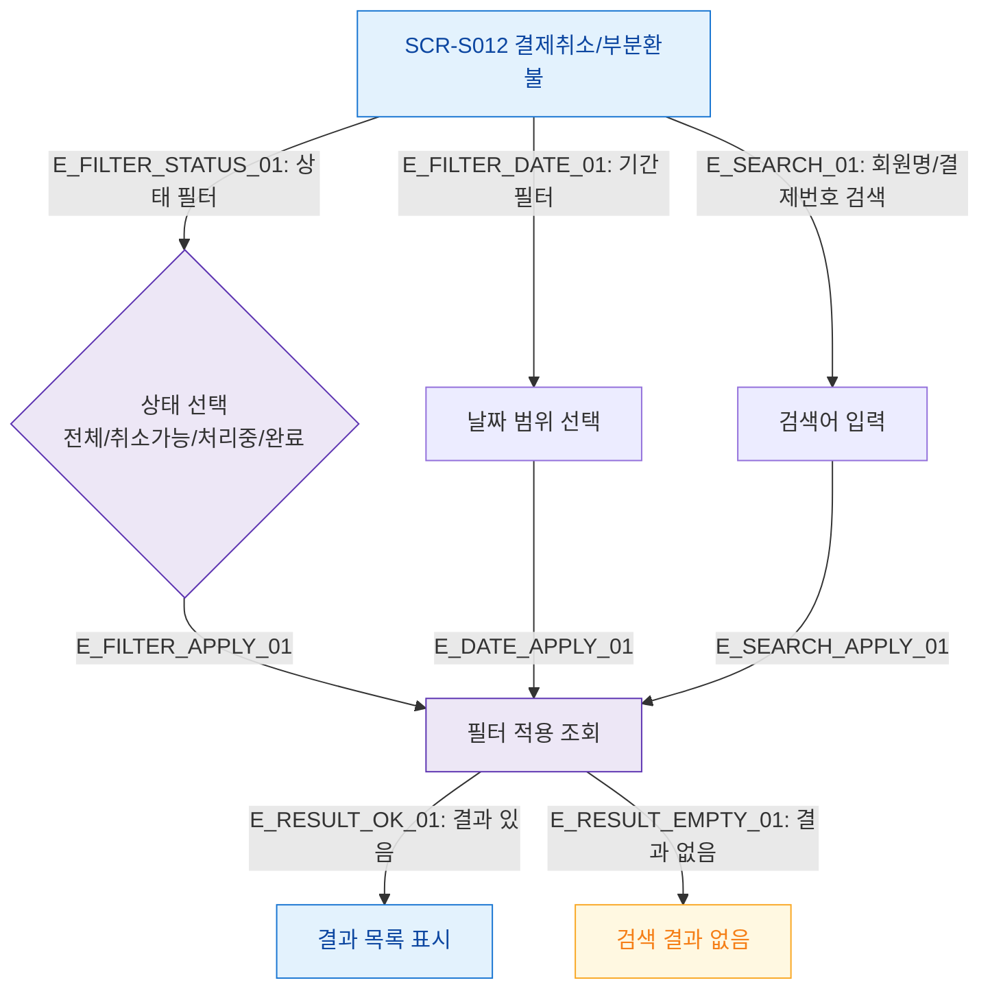

## 1. 목적
SCR-S012의 필터 및 검색 조건 처리 흐름을 표현한다.

## 2. 전제조건
- SCR-S012 진입 완료

## 3. 다이어그램

## 4. 엣지 설명

| 엣지 ID | 출발 | 도착 | 설명 |
|---------|------|------|------|
| E_FILTER_STATUS_01 | S012 | STATUS_FILTER | 상태별 필터 |
| E_FILTER_DATE_01 | S012 | DATE_FILTER | 기간 필터 |
| E_SEARCH_01 | S012 | SEARCH | 검색어 입력 |
| E_FILTER_APPLY_01 | STATUS_FILTER | FETCH_FILTERED | 필터 적용 |

## 5. TC 후보

| TC ID | 타입 | Given | When | Then |
|-------|------|-------|------|------|
| TC-S012-F4-01 | positive | 목록 표시 중 | 상태 필터 '취소가능' | 해당 건만 필터링 |
| TC-S012-F4-02 | positive | 목록 표시 중 | 없는 이름 검색 | 결과 없음 표시 |
