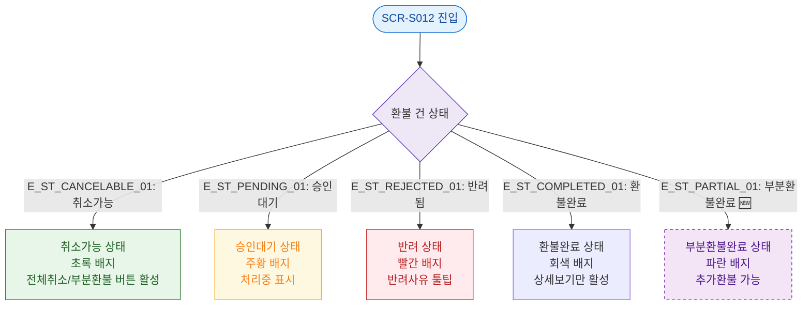

## 1. 목적
SCR-S012의 각 환불 건 상태별 UI 표현 방식을 정의한다.

## 2. 전제조건
- SCR-S012 진입 완료

## 3. 다이어그램

## 4. 엣지 설명

| 엣지 ID | 출발 | 도착 | 설명 |
|---------|------|------|------|
| E_ST_CANCELABLE_01 | STATUS_CHECK | CANCELABLE | 취소 가능 상태 |
| E_ST_PENDING_01 | STATUS_CHECK | PENDING | 승인 대기 중 |
| E_ST_REJECTED_01 | STATUS_CHECK | REJECTED_ST | 반려된 요청 |
| E_ST_COMPLETED_01 | STATUS_CHECK | COMPLETED | 환불 완료 |
| E_ST_PARTIAL_01 | STATUS_CHECK | PARTIAL_DONE | 부분환불 완료 (🆕) |

## 5. TC 후보

| TC ID | 타입 | Given | When | Then |
|-------|------|-------|------|------|
| TC-S012-F6-01 | positive | 취소가능 건 | 화면 진입 | 초록 배지, 버튼 활성 |
| TC-S012-F6-02 | positive | 환불완료 건 | 화면 진입 | 회색 배지, 상세보기만 활성 |
| TC-S012-F6-03 | positive | 반려된 건 | 화면 진입 | 빨간 배지, 반려사유 표시 |
