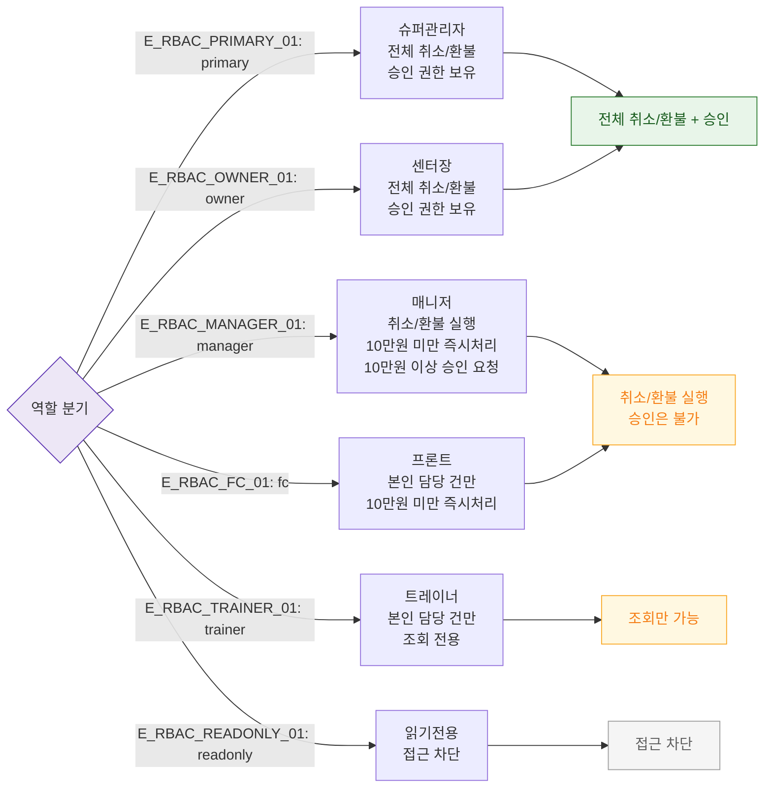

## 1. 목적
SCR-S012에서 역할별 접근 범위와 승인 권한을 표현한다.

## 2. 전제조건
- 로그인 완료

## 3. 다이어그램

## 4. 엣지 설명

| 엣지 ID | 출발 | 도착 | 설명 |
|---------|------|------|------|
| E_RBAC_PRIMARY_01 | AUTH | P | 슈퍼관리자 — 전체 권한 + 승인 |
| E_RBAC_OWNER_01 | AUTH | O | 센터장 — 전체 권한 + 승인 |
| E_RBAC_MANAGER_01 | AUTH | M | 매니저 — 실행 가능, 승인 불가 |
| E_RBAC_FC_01 | AUTH | FC | 프론트 — 담당 건 제한 |
| E_RBAC_TRAINER_01 | AUTH | TR | 트레이너 — 조회 전용 |
| E_RBAC_READONLY_01 | AUTH | RO | readonly — 접근 차단 |

## 5. TC 후보

| TC ID | 타입 | Given | When | Then |
|-------|------|-------|------|------|
| TC-S012-F7-01 | positive | owner 로그인 | 15만원 취소 요청 | 즉시 처리 (승인 불필요) |
| TC-S012-F7-02 | positive | manager 로그인 | 15만원 취소 요청 | 승인 요청 발송 |
| TC-S012-F7-03 | negative | readonly 로그인 | 진입 시도 | 접근 차단 |
