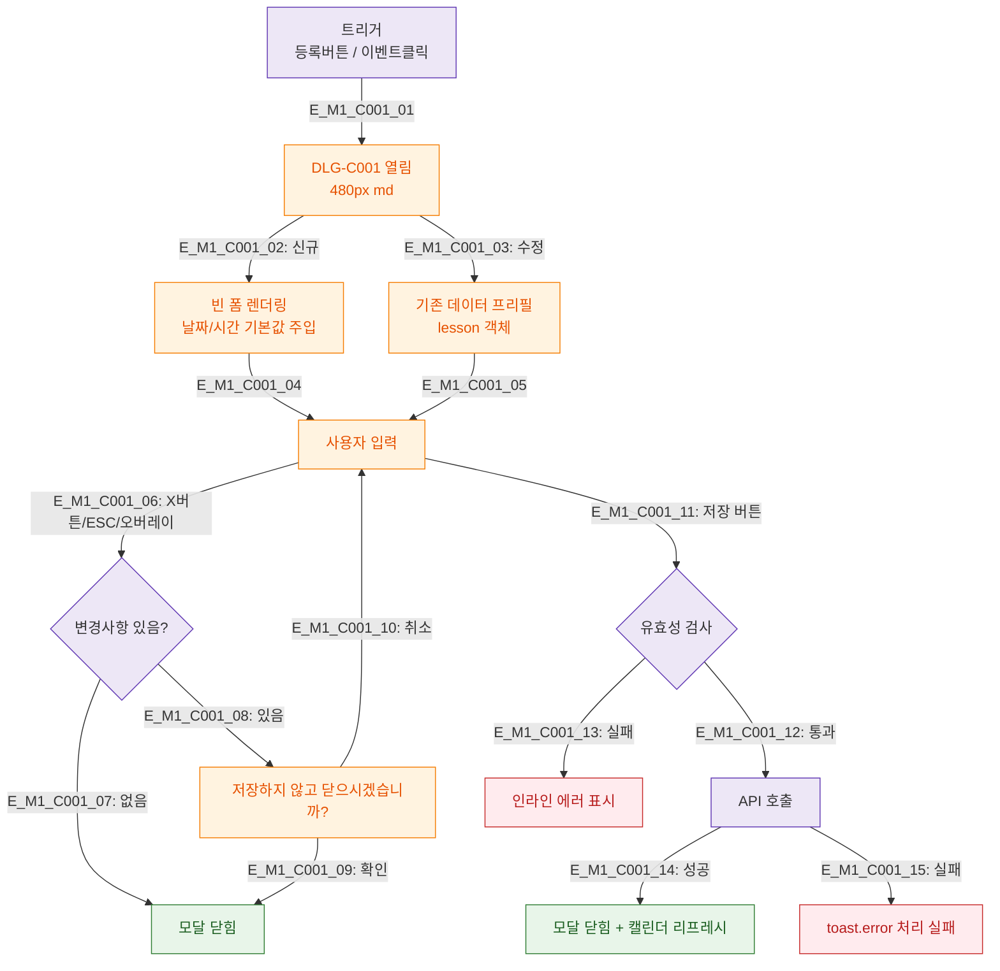

## 1. 목적
DLG-C001 수업등록/수정(캘린더) 모달의 열림/닫힘/제출 생명주기를 정의한다.

## 2. 전제조건
- SCR-C001 진입 완료
- 수업 등록 버튼 또는 캘린더 이벤트 클릭

## 3. 다이어그램

## 4. 엣지 설명

| 엣지 ID | 설명 |
|---------|------|
| E_M1_C001_02~03 | 신규(빈폼) / 수정(프리필) 분기 |
| E_M1_C001_06~10 | 닫기 시 변경사항 확인 다이얼로그 |
| E_M1_C001_11~15 | 저장 → 유효성 → API → 성공/실패 |

## 5. TC 후보

| TC ID | 타입 | Given | When | Then |
|-------|------|-------|------|------|
| TC-C001-M1-01 | positive | 매니저 | 수업 등록 버튼 클릭 | 빈 폼 모달 열림 |
| TC-C001-M1-02 | positive | 매니저, 기존 수업 | 이벤트 클릭 | 프리필 모달 열림 |
| TC-C001-M1-03 | negative | 입력 중 | X 버튼 클릭 | 저장 확인 다이얼로그 |
| TC-C001-M1-04 | positive | 저장 성공 | 제출 | 모달 닫힘 + 캘린더 갱신 |
