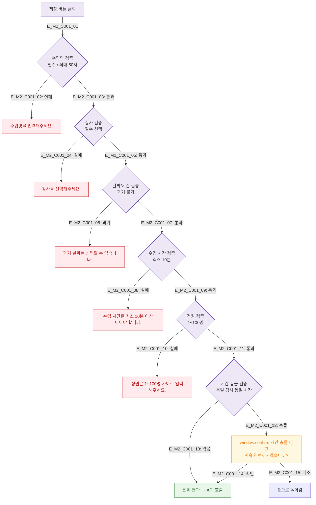

## 1. 목적
DLG-C001에서 각 입력 필드의 유효성 검사 규칙과 에러 표시 방식을 정의한다.

## 2. 전제조건
- DLG-C001 열림 상태

## 3. 다이어그램

## 4. 엣지 설명

| 필드 | 규칙 | 에러 메시지 |
|------|------|------------|
| 수업명 | 필수, 최대 50자 | 수업명을 입력해주세요. |
| 강사 | 필수 선택 | 강사를 선택해주세요. |
| 날짜/시간 | 과거 불가 | 과거 날짜는 선택할 수 없습니다. |
| 수업 시간 | 최소 10분 | 수업 시간은 최소 10분 이상이어야 합니다. |
| 정원 | 1~100명 | 정원은 1~100명 사이로 입력해주세요. |
| 시간 충돌 | 동일 강사 동일 시간 | window.confirm 경고 |

## 5. TC 후보

| TC ID | 타입 | Given | When | Then |
|-------|------|-------|------|------|
| TC-C001-M2-01 | negative | 수업명 빈값 | 저장 | 인라인 에러 |
| TC-C001-M2-02 | negative | 과거 날짜 선택 | 저장 | 날짜 에러 |
| TC-C001-M2-03 | negative | 시간 충돌 | 저장 | window.confirm 경고 |
| TC-C001-M2-04 | positive | 충돌 경고 후 확인 | 계속 | API 호출 진행 |
