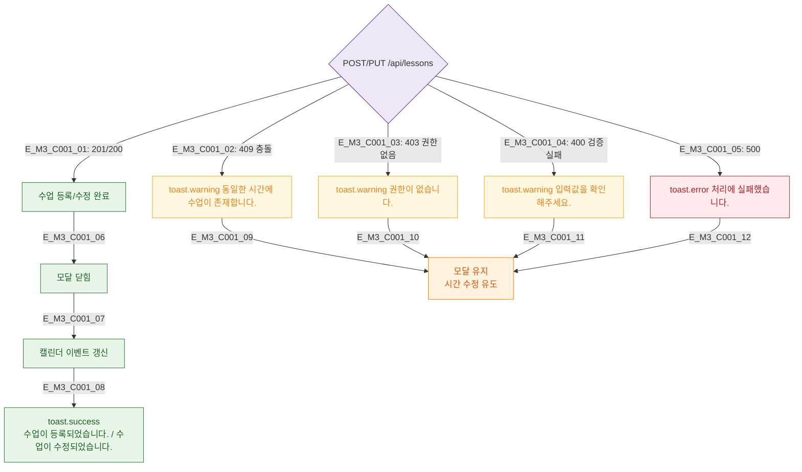

## 1. 목적
DLG-C001 제출 후 API 응답에 따른 결과 분기를 정의한다.

## 2. 전제조건
- 유효성 검사 통과 후 API 호출

## 3. 다이어그램

## 4. 엣지 설명

| 응답 코드 | 동작 | 모달 상태 |
|-----------|------|----------|
| 201/200 | success 토스트 + 캘린더 갱신 | 닫힘 |
| 409 | warning 토스트 | 유지 |
| 403 | warning 토스트 | 유지 |
| 400 | warning 토스트 | 유지 |
| 500 | error 토스트 | 유지 |

## 5. TC 후보

| TC ID | 타입 | Given | When | Then |
|-------|------|-------|------|------|
| TC-C001-M3-01 | positive | 유효한 입력 | 저장 | 모달 닫힘 + 캘린더 갱신 |
| TC-C001-M3-02 | negative | 409 응답 | 저장 | 경고 토스트 + 모달 유지 |
| TC-C001-M3-03 | negative | 500 응답 | 저장 | 에러 토스트 + 모달 유지 |
