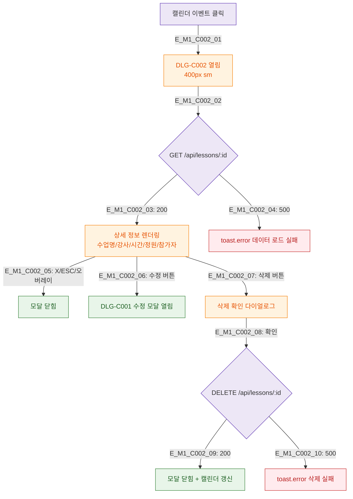

## 1. 목적
DLG-C002 일정상세 모달의 열림/닫힘 생명주기를 정의한다.

## 2. 전제조건
- SCR-C001 캘린더 이벤트 클릭

## 3. 다이어그램

## 4. 엣지 설명

| 엣지 ID | 설명 |
|---------|------|
| E_M1_C002_02~04 | 진입 시 상세 데이터 로드 |
| E_M1_C002_06 | 수정 → DLG-C001 체인 |
| E_M1_C002_07~10 | 삭제 확인 → API → 성공/실패 |

## 5. TC 후보

| TC ID | 타입 | Given | When | Then |
|-------|------|-------|------|------|
| TC-C002-M1-01 | positive | 매니저 | 캘린더 이벤트 클릭 | 상세 모달 열림 |
| TC-C002-M1-02 | positive | 매니저 | 삭제 확인 | 모달 닫힘 + 갱신 |
| TC-C002-M1-03 | negative | API 500 | 진입 시 | 에러 토스트 |
