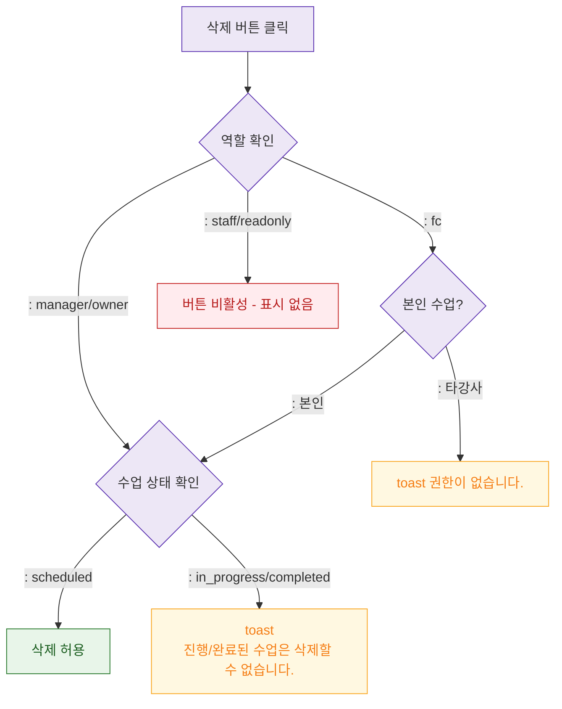

## 1. 목적
DLG-C002에서 삭제 권한 검증 로직을 정의한다.

## 2. 전제조건
- DLG-C002 열림 상태

## 3. 다이어그램

## 4. 엣지 설명

| 역할 | 삭제 가능 조건 | |------|--------------| | manager/owner | scheduled 상태만 | | fc | 본인 수업 + scheduled | | staff/readonly | 불가 |
