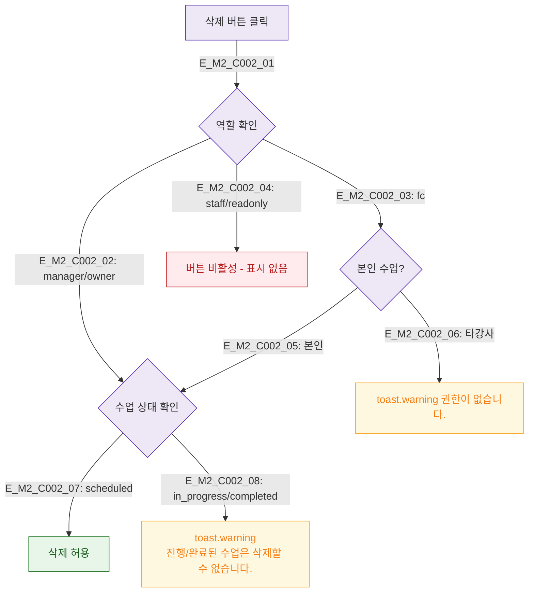

## 1. 목적
DLG-C002에서 삭제 권한 검증 로직을 정의한다.

## 2. 전제조건
- DLG-C002 열림 상태

## 3. 다이어그램

## 4. 엣지 설명

| 역할 | 삭제 가능 조건 |
|------|--------------|
| manager/owner | scheduled 상태만 |
| fc | 본인 수업 + scheduled |
| staff/readonly | 불가 |

## 5. TC 후보

| TC ID | 타입 | Given | When | Then |
|-------|------|-------|------|------|
| TC-C002-M2-01 | negative | fc, 타강사 수업 | 삭제 시도 | 권한 없음 경고 |
| TC-C002-M2-02 | negative | completed 수업 | 삭제 시도 | 삭제 불가 경고 |
| TC-C002-M2-03 | positive | manager, scheduled | 삭제 | 삭제 허용 |
