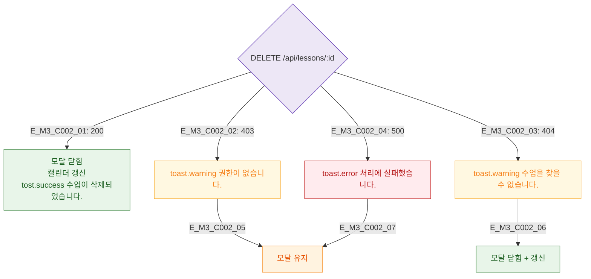

## 1. 목적
DLG-C002 삭제/수정 액션의 결과 분기를 정의한다.

## 2. 전제조건
- 삭제/수정 API 호출 후

## 3. 다이어그램

## 4. 엣지 설명

| 응답 | 동작 |
|------|------|
| 200 | success 토스트 + 모달 닫힘 + 캘린더 갱신 |
| 403 | warning + 모달 유지 |
| 404 | warning + 모달 닫힘 |
| 500 | error + 모달 유지 |

## 5. TC 후보

| TC ID | 타입 | Given | When | Then |
|-------|------|-------|------|------|
| TC-C002-M3-01 | positive | 200 | 삭제 | 모달 닫힘 + 갱신 |
| TC-C002-M3-02 | negative | 403 | 삭제 | 경고 + 모달 유지 |
| TC-C002-M3-03 | negative | 500 | 삭제 | 에러 + 모달 유지 |
