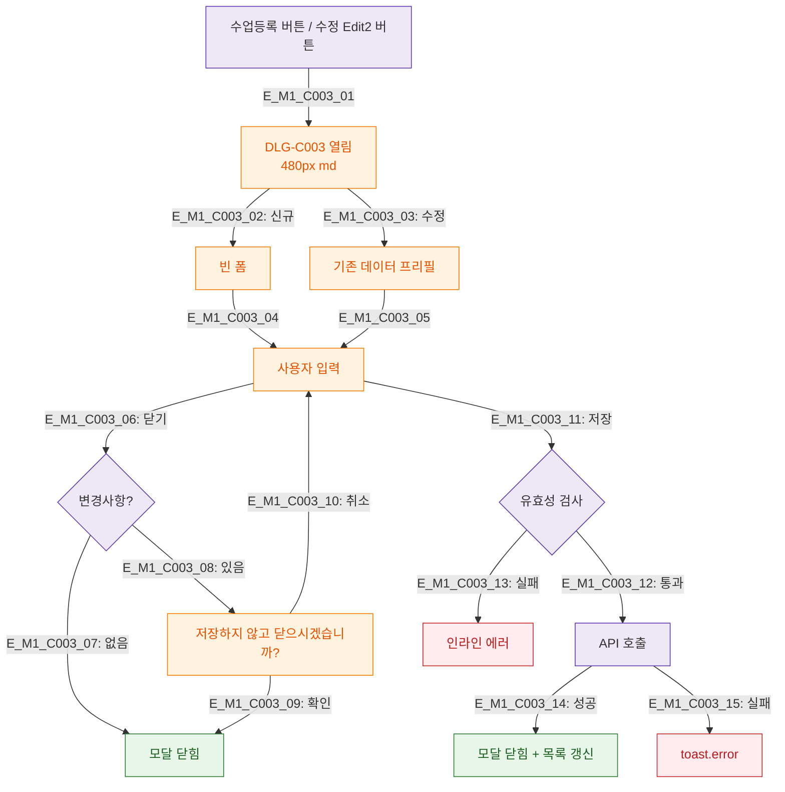

## 1. 목적
DLG-C003 수업등록/수정(관리화면) 모달의 생명주기를 정의한다.

## 2. 전제조건
- SCR-C002 수업관리 화면 진입 완료

## 3. 다이어그램

## 4. 엣지 설명

| 엣지 ID | 설명 |
|---------|------|
| E_M1_C003_02~03 | 신규/수정 분기 |
| E_M1_C003_06~10 | 닫기 시 변경사항 확인 |
| E_M1_C003_11~15 | 저장 플로우 |

## 5. TC 후보

| TC ID | 타입 | Given | When | Then |
|-------|------|-------|------|------|
| TC-C003-M1-01 | positive | 매니저 | 수업 등록 버튼 | 빈 폼 모달 |
| TC-C003-M1-02 | positive | 매니저 | 수정 버튼 | 프리필 모달 |
| TC-C003-M1-03 | positive | 저장 성공 | 제출 | 모달 닫힘 + 목록 갱신 |
