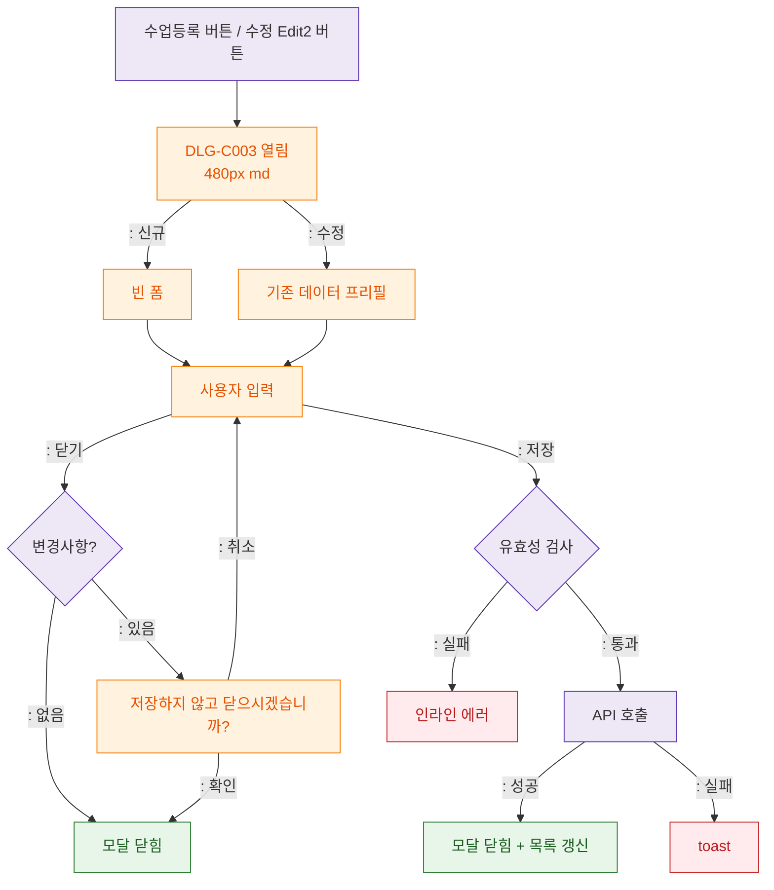

## 1. 목적
DLG-C003 수업등록/수정(관리화면) 모달의 생명주기를 정의한다.

## 2. 전제조건
- SCR-C002 수업관리 화면 진입 완료

## 3. 다이어그램

```mermaid
flowchart TD
  Trigger[수업등록 버튼 / 수정 Edit2 버튼] --> Open[DLG-C003 열림\n480px md]
  Open -->|": 신규"|BlankForm[빈 폼]
  Open -->|": 수정"|PrefilledForm[기존 데이터 프리필]

  BlankForm --> UserInput[사용자 입력]
  PrefilledForm --> UserInput

  UserInput -->|": 닫기"|UnsavedCheck{변경사항?}
  UnsavedCheck -->|": 없음"|Close[모달 닫힘]
  UnsavedCheck -->|": 있음"|UnsavedDlg[저장하지 않고 닫으시겠습니까?]
  UnsavedDlg -->|": 확인"|Close
  UnsavedDlg -->|": 취소"|UserInput

  UserInput -->|": 저장"|Validate{유효성 검사}
  Validate -->|": 통과"|Submit[API 호출]
  Validate -->|": 실패"|ValidationErr[인라인 에러]
  Submit -->|": 성공"|CloseRefresh[모달 닫힘 + 목록 갱신]
  Submit -->|": 실패"|APIErr[toast]

  classDef modal fill:#FFF3E0,stroke:#F57C00,color:#E65100
  classDef system fill:#EDE7F6,stroke:#5E35B2
  classDef success fill:#E8F5E9,stroke:#2E7D32,color:#1B5E20
  classDef error fill:#FFEBEE,stroke:#C62828,color:#B71C1C
  class Open,BlankForm,PrefilledForm,UserInput,UnsavedDlg modal
  class Trigger,UnsavedCheck,Validate,Submit system
  class CloseRefresh,Close success
  class ValidationErr,APIErr error
```

## 4. 엣지 설명

| 설명 | |---------|------| | ~03 | 신규/수정 분기 | | ~10 | 닫기 시 변경사항 확인 | | ~15 | 저장 플로우 |
