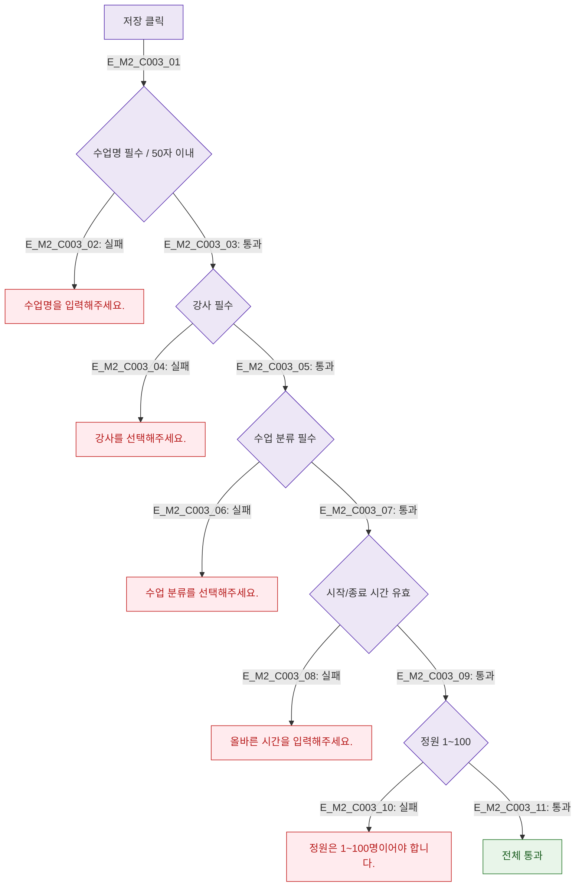

## 1. 목적
DLG-C003 필드별 유효성 검사 규칙을 정의한다.

## 2. 전제조건
- DLG-C003 열림 상태

## 3. 다이어그램

## 4. 엣지 설명

| 필드 | 규칙 |
|------|------|
| 수업명 | 필수, 최대 50자 |
| 강사 | 필수 선택 |
| 수업 분류 | 필수 선택 |
| 시작/종료 시간 | 종료 > 시작 |
| 정원 | 1~100 정수 |

## 5. TC 후보

| TC ID | 타입 | Given | When | Then |
|-------|------|-------|------|------|
| TC-C003-M2-01 | negative | 수업명 빈값 | 저장 | 인라인 에러 |
| TC-C003-M2-02 | negative | 정원 0 입력 | 저장 | 정원 에러 |
| TC-C003-M2-03 | positive | 전체 유효 입력 | 저장 | 통과 |
