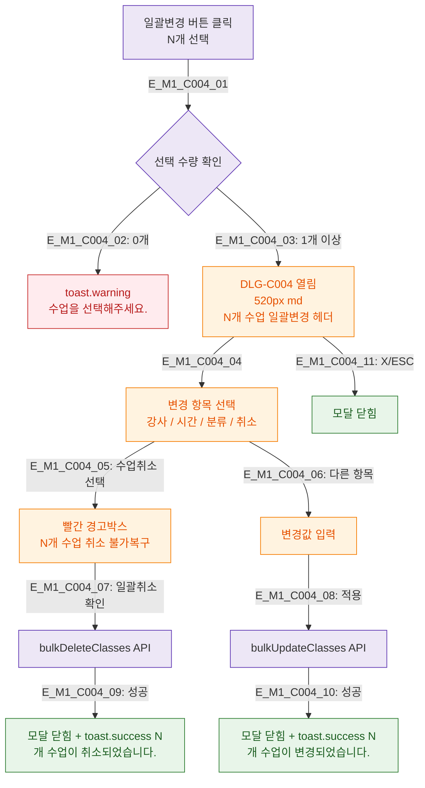

## 1. 목적
DLG-C004 일괄변경 모달의 생명주기를 정의한다.

## 2. 전제조건
- SCR-C002에서 1개 이상 수업 선택 후 일괄변경 버튼 클릭

## 3. 다이어그램

## 4. 엣지 설명

| 엣지 ID | 설명 |
|---------|------|
| E_M1_C004_02 | 선택 0개 → 경고 토스트 |
| E_M1_C004_05 | 취소 선택 → 빨간 경고박스 |
| E_M1_C004_07~08 | 일괄취소/변경 API 호출 |

## 5. TC 후보

| TC ID | 타입 | Given | When | Then |
|-------|------|-------|------|------|
| TC-C004-M1-01 | negative | 0개 선택 | 일괄변경 버튼 | 경고 토스트 |
| TC-C004-M1-02 | positive | 3개 선택 | 일괄변경 | 모달 열림 |
| TC-C004-M1-03 | positive | 취소 선택 | 확인 | 일괄취소 완료 |
