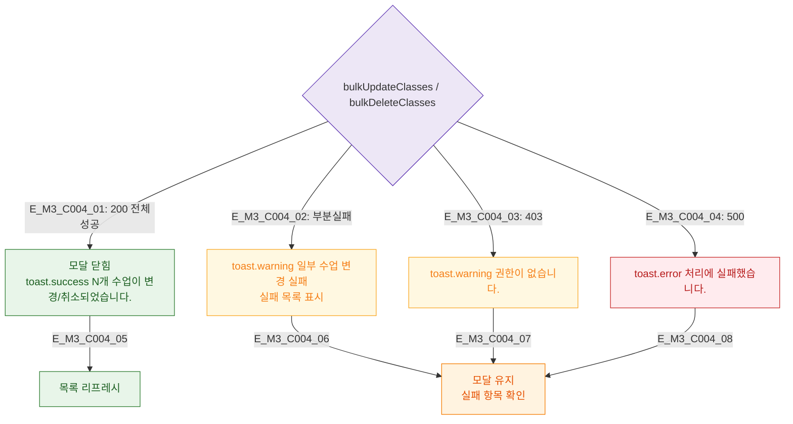

## 1. 목적
DLG-C004 일괄변경/일괄취소 API 결과 분기를 정의한다.

## 2. 전제조건
- 유효성 통과 후 API 호출

## 3. 다이어그램

## 4. 엣지 설명

| 응답 | 동작 |
|------|------|
| 200 전체성공 | success 토스트 + 모달 닫힘 |
| 부분실패 | warning + 실패 목록 + 모달 유지 |
| 403 | warning + 모달 유지 |
| 500 | error + 모달 유지 |

## 5. TC 후보

| TC ID | 타입 | Given | When | Then |
|-------|------|-------|------|------|
| TC-C004-M3-01 | positive | 전체 성공 | 일괄변경 | 모달 닫힘 + 갱신 |
| TC-C004-M3-02 | negative | 부분 실패 | 일괄변경 | 경고 + 실패 목록 |
| TC-C004-M3-03 | negative | 500 | 일괄변경 | 에러 + 유지 |
