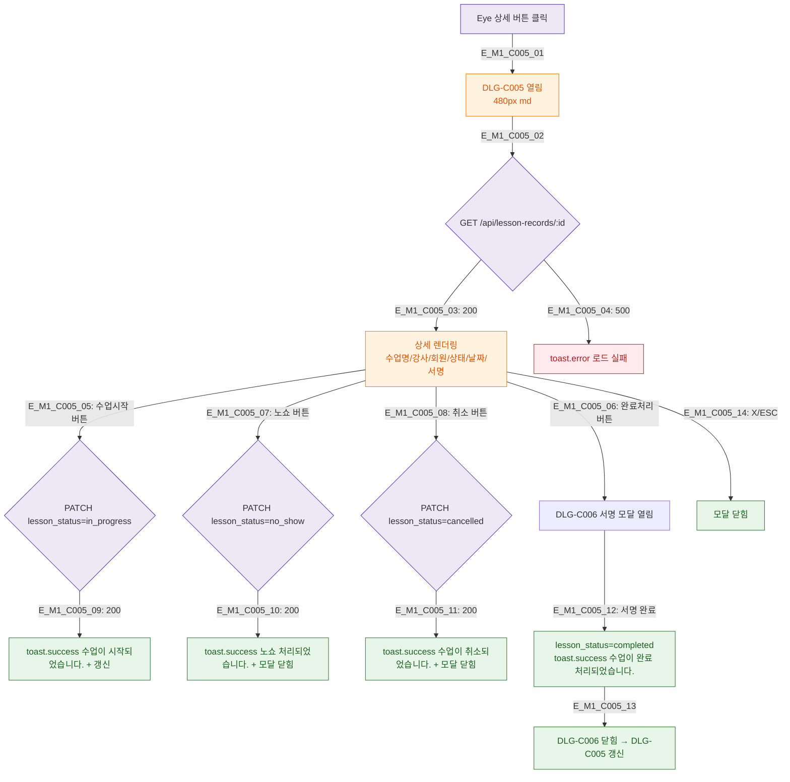

## 1. 목적
DLG-C005 수업기록 상세 모달의 생명주기와 하위 모달 체인을 정의한다.

## 2. 전제조건
- SCR-C002 수업기록 테이블에서 Eye 버튼 클릭

## 3. 다이어그램

## 4. 엣지 설명

| 버튼 | 동작 |
|------|------|
| 수업시작 | lesson_status=in_progress |
| 완료처리 | DLG-C006 서명 체인 |
| 노쇼 | lesson_status=no_show + 모달 닫힘 |
| 취소 | lesson_status=cancelled + 모달 닫힘 |

## 5. TC 후보

| TC ID | 타입 | Given | When | Then |
|-------|------|-------|------|------|
| TC-C005-M1-01 | positive | scheduled 기록 | 수업시작 | in_progress 처리 |
| TC-C005-M1-02 | positive | in_progress | 완료처리 | DLG-C006 열림 |
| TC-C005-M1-03 | positive | scheduled | 노쇼 | no_show 처리 + 닫힘 |
