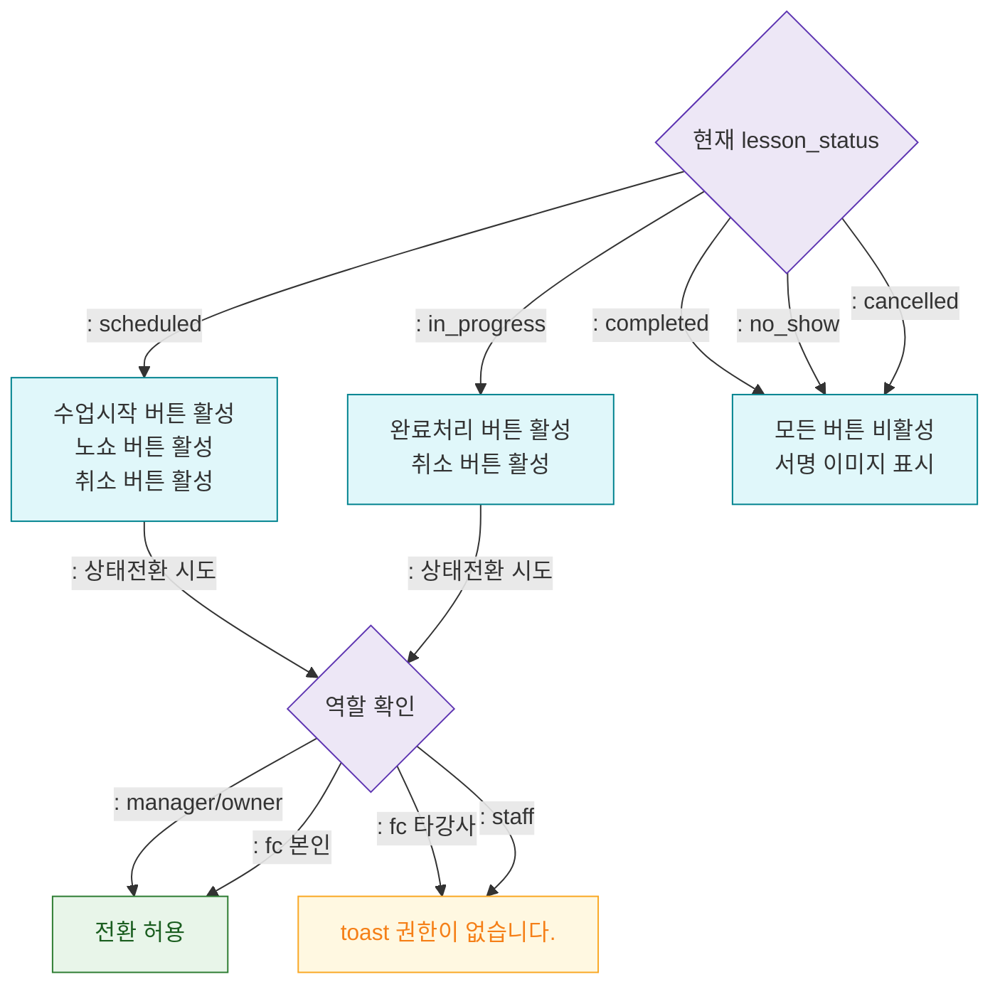

## 1. 목적
DLG-C005에서 상태 전환 버튼의 활성화 조건을 정의한다.

## 2. 전제조건
- DLG-C005 열림 상태

## 3. 다이어그램

## 4. 엣지 설명

| 상태 | 활성 버튼 | |------|----------| | scheduled | 수업시작 / 노쇼 / 취소 | | in_progress | 완료처리 / 취소 | | completed | 없음 (읽기전용) |
