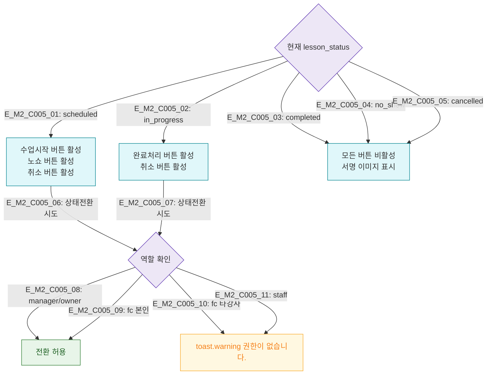

## 1. 목적
DLG-C005에서 상태 전환 버튼의 활성화 조건을 정의한다.

## 2. 전제조건
- DLG-C005 열림 상태

## 3. 다이어그램

## 4. 엣지 설명

| 상태 | 활성 버튼 |
|------|----------|
| scheduled | 수업시작 / 노쇼 / 취소 |
| in_progress | 완료처리 / 취소 |
| completed/no_show/cancelled | 없음 (읽기전용) |

## 5. TC 후보

| TC ID | 타입 | Given | When | Then |
|-------|------|-------|------|------|
| TC-C005-M2-01 | positive | scheduled | 모달 열림 | 수업시작/노쇼/취소 버튼 활성 |
| TC-C005-M2-02 | positive | completed | 모달 열림 | 모든 버튼 비활성 |
| TC-C005-M2-03 | negative | fc 타강사 | 상태전환 시도 | 권한 경고 |
