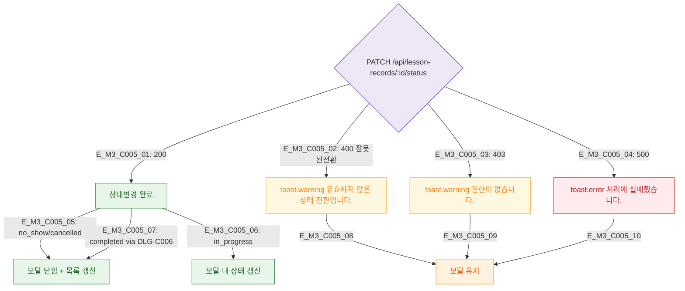

## 1. 목적
DLG-C005 상태변경 API 결과 분기를 정의한다.

## 2. 전제조건
- 상태변경 API 호출 후

## 3. 다이어그램

## 4. 엣지 설명

| 응답 | 동작 |
|------|------|
| 200 no_show/cancelled | 모달 닫힘 |
| 200 in_progress | 모달 내 갱신 |
| 400 | 상태전환 불가 경고 |
| 403 | 권한 경고 |
| 500 | 에러 |

## 5. TC 후보

| TC ID | 타입 | Given | When | Then |
|-------|------|-------|------|------|
| TC-C005-M3-01 | positive | 노쇼 처리 200 | 저장 | 모달 닫힘 |
| TC-C005-M3-02 | negative | completed → in_progress | 시도 | 전환 불가 경고 |
| TC-C005-M3-03 | negative | 500 | 상태변경 | 에러 + 유지 |
