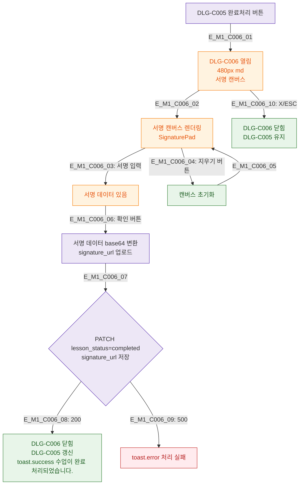

## 1. 목적
DLG-C006 서명 모달의 생명주기를 정의한다.

## 2. 전제조건
- DLG-C005에서 완료처리 버튼 클릭

## 3. 다이어그램

## 4. 엣지 설명

| 엣지 ID | 설명 |
|---------|------|
| E_M1_C006_03~05 | 서명 입력 / 지우기 반복 |
| E_M1_C006_06~09 | 확인 → base64 → API → 성공/실패 |
| E_M1_C006_10 | 취소 → DLG-C005 유지 |

## 5. TC 후보

| TC ID | 타입 | Given | When | Then |
|-------|------|-------|------|------|
| TC-C006-M1-01 | positive | in_progress 기록 | 완료처리 | 서명 모달 열림 |
| TC-C006-M1-02 | positive | 서명 후 확인 | 저장 | completed + 서명 저장 |
| TC-C006-M1-03 | negative | 서명 없이 확인 | 저장 | 서명 필요 에러 |
