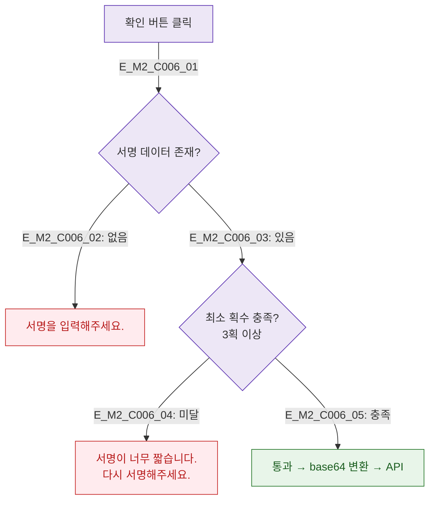

## 1. 목적
DLG-C006 서명 데이터 유효성 검사를 정의한다.

## 2. 전제조건
- DLG-C006 열림 상태, 확인 버튼 클릭

## 3. 다이어그램

## 4. 엣지 설명

| 검증 | 규칙 |
|------|------|
| 서명 존재 | 캔버스에 데이터 필수 |
| 최소 획수 | 3획 이상 |

## 5. TC 후보

| TC ID | 타입 | Given | When | Then |
|-------|------|-------|------|------|
| TC-C006-M2-01 | negative | 빈 캔버스 | 확인 | 서명 필요 에러 |
| TC-C006-M2-02 | negative | 1획 서명 | 확인 | 최소 획수 에러 |
| TC-C006-M2-03 | positive | 정상 서명 | 확인 | 통과 |
