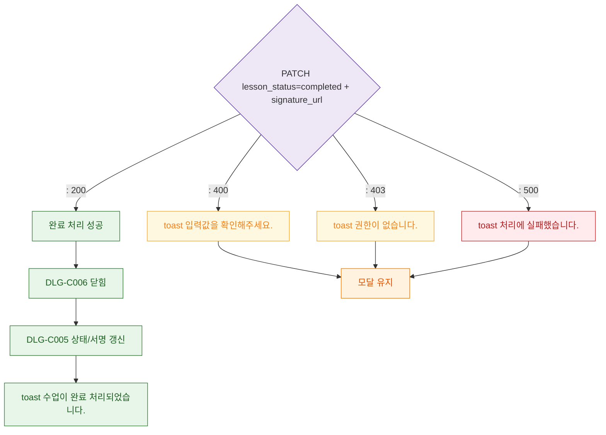

## 1. 목적
DLG-C006 서명 저장 API 결과 분기를 정의한다.

## 2. 전제조건
- 서명 유효성 통과 후 API 호출

## 3. 다이어그램

## 4. 엣지 설명

| 응답 | 동작 | |------|------| | 200 | DLG-C006 닫힘 → DLG-C005 갱신 → success 토스트 | | 400/403 | 경고 + 모달 유지 | | 500 | 에러 + 모달 유지 |
