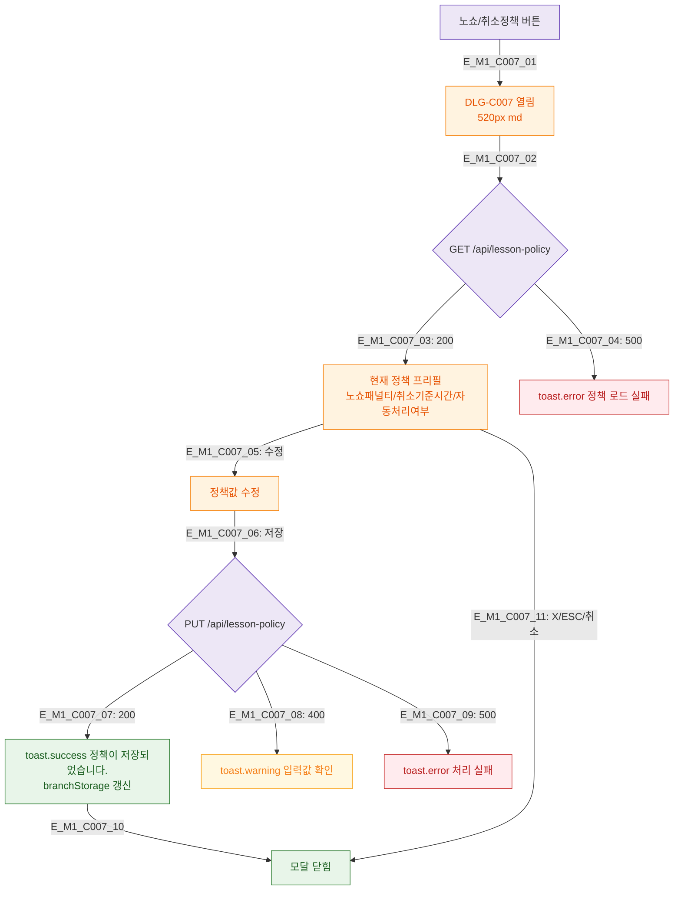

## 1. 목적
DLG-C007 노쇼/취소정책 설정 모달의 생명주기를 정의한다.

## 2. 전제조건
- SCR-C002에서 노쇼/취소정책 버튼 클릭 (manager/owner 전용)

## 3. 다이어그램

## 4. 엣지 설명

| 엣지 ID | 설명 |
|---------|------|
| E_M1_C007_02~04 | 진입 시 현재 정책 로드 |
| E_M1_C007_06~09 | 저장 → API → 성공/실패 |
| E_M1_C007_07 | branchStorage 갱신 (로컬 캐시) |

## 5. TC 후보

| TC ID | 타입 | Given | When | Then |
|-------|------|-------|------|------|
| TC-C007-M1-01 | positive | manager | 정책 버튼 클릭 | 현재 정책 프리필 모달 |
| TC-C007-M1-02 | positive | 정책 수정 후 저장 | 저장 | success 토스트 + 닫힘 |
| TC-C007-M1-03 | negative | 500 | 저장 | 에러 + 유지 |
