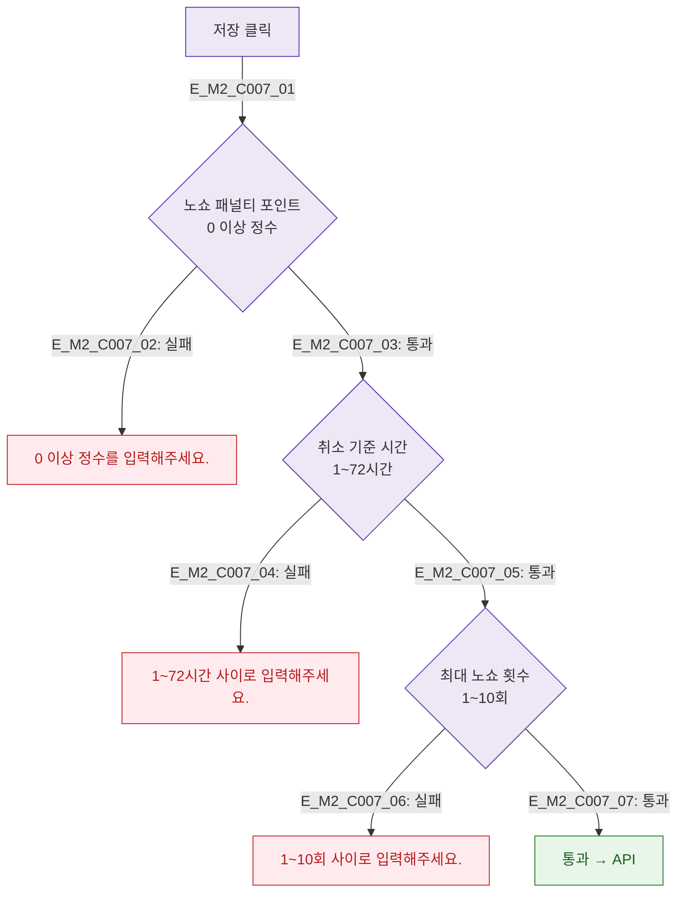

## 1. 목적
DLG-C007 정책 필드별 유효성 검사를 정의한다.

## 2. 전제조건
- DLG-C007 열림 상태, 저장 클릭

## 3. 다이어그램

## 4. 엣지 설명

| 필드 | 규칙 |
|------|------|
| 노쇼 패널티 | 0 이상 정수 |
| 취소 기준 시간 | 1~72시간 |
| 최대 노쇼 횟수 | 1~10회 |

## 5. TC 후보

| TC ID | 타입 | Given | When | Then |
|-------|------|-------|------|------|
| TC-C007-M2-01 | negative | 노쇼 패널티 -1 | 저장 | 에러 |
| TC-C007-M2-02 | negative | 취소 기준 100시간 | 저장 | 범위 에러 |
| TC-C007-M2-03 | positive | 유효값 전체 | 저장 | 통과 |
