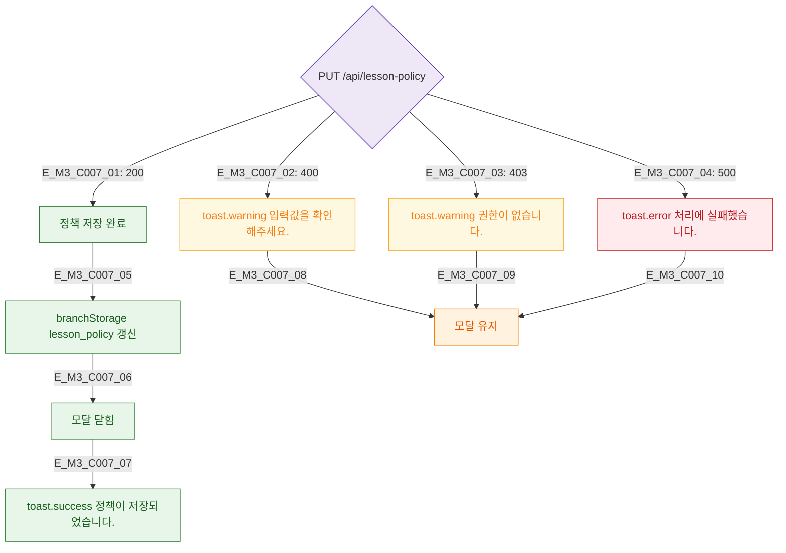

## 1. 목적
DLG-C007 저장 API 결과 분기를 정의한다.

## 2. 전제조건
- 유효성 통과 후 API 호출

## 3. 다이어그램

## 4. 엣지 설명

| 응답 | 동작 |
|------|------|
| 200 | branchStorage 갱신 → 닫힘 → success 토스트 |
| 400/403 | 경고 + 유지 |
| 500 | 에러 + 유지 |

## 5. TC 후보

| TC ID | 타입 | Given | When | Then |
|-------|------|-------|------|------|
| TC-C007-M3-01 | positive | 200 | 저장 | 닫힘 + success |
| TC-C007-M3-02 | negative | 403 | 저장 | 권한 경고 + 유지 |
| TC-C007-M3-03 | negative | 500 | 저장 | 에러 + 유지 |
