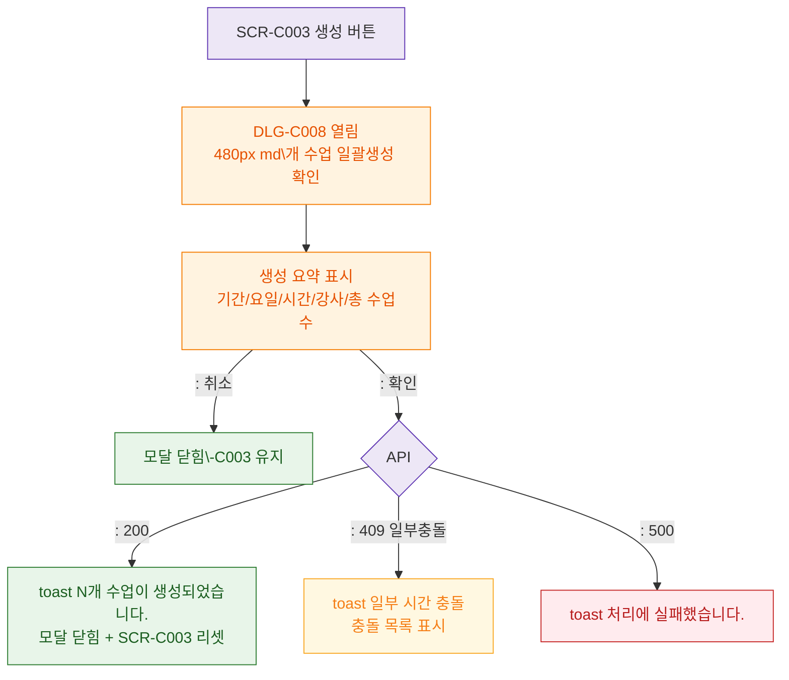

## 1. 목적
DLG-C008 시간표 일괄생성 확인 모달의 생명주기를 정의한다.

## 2. 전제조건
- SCR-C003에서 미리보기 확인 후 생성 버튼 클릭

## 3. 다이어그램

## 4. 엣지 설명

| 설명 | |---------|------| | | 생성 요약 (기간/요일/시간/강사/총수업수) | | ~07 | 확인 → API → 성공/충돌/에러 |
