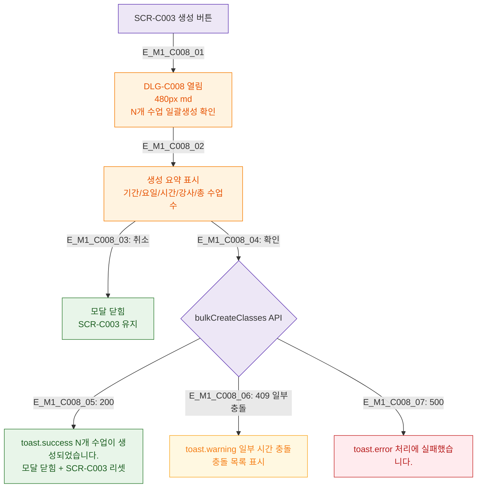

## 1. 목적
DLG-C008 시간표 일괄생성 확인 모달의 생명주기를 정의한다.

## 2. 전제조건
- SCR-C003에서 미리보기 확인 후 생성 버튼 클릭

## 3. 다이어그램

## 4. 엣지 설명

| 엣지 ID | 설명 |
|---------|------|
| E_M1_C008_02 | 생성 요약 (기간/요일/시간/강사/총수업수) |
| E_M1_C008_04~07 | 확인 → API → 성공/충돌/에러 |

## 5. TC 후보

| TC ID | 타입 | Given | When | Then |
|-------|------|-------|------|------|
| TC-C008-M1-01 | positive | 유효 설정 | 확인 | N개 수업 생성 + 리셋 |
| TC-C008-M1-02 | negative | 일부 충돌 | 확인 | 충돌 경고 + 목록 |
| TC-C008-M1-03 | positive | 확인 전 취소 | 취소 | 모달 닫힘 + SCR-C003 유지 |
