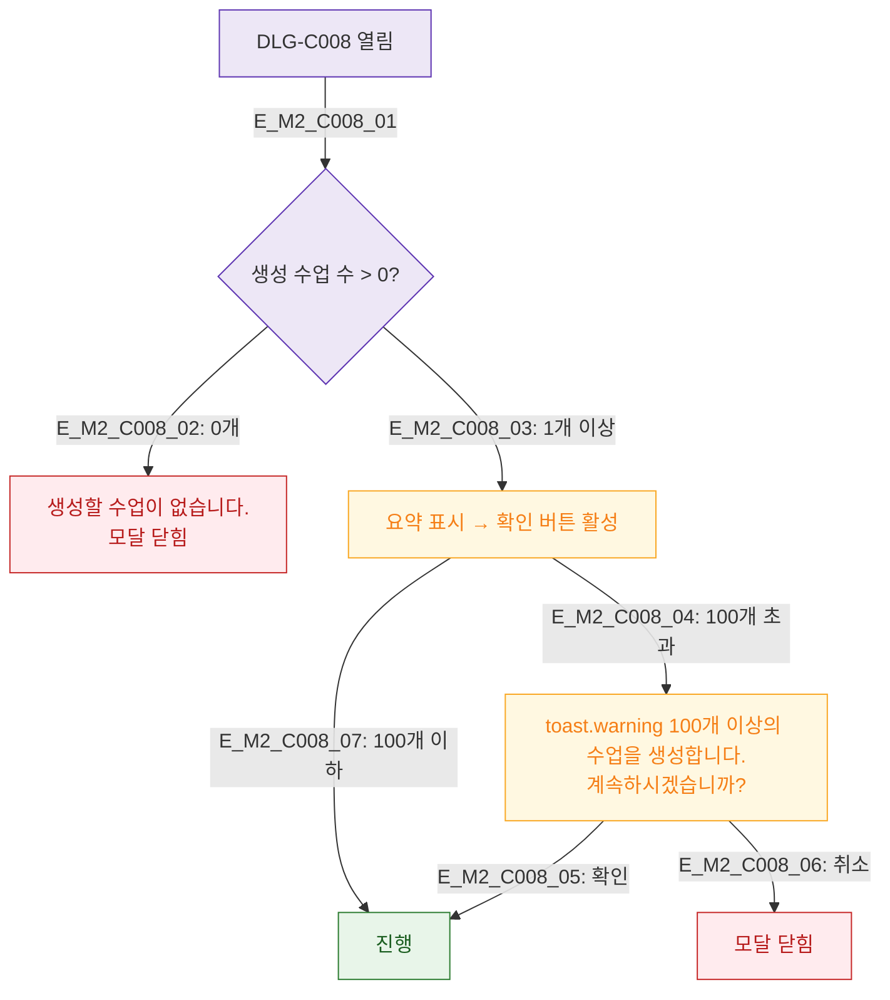

## 1. 목적
DLG-C008은 확인 모달이므로 SCR-C003에서 이미 검증된 데이터를 요약 표시한다.
추가 검증은 최소화하며 확인 단계의 체크만 정의한다.

## 2. 전제조건
- SCR-C003 유효성 통과 후 DLG-C008 열림

## 3. 다이어그램

## 4. 엣지 설명

| 검증 | 규칙 |
|------|------|
| 수업 수 | 최소 1개 이상 |
| 대량 생성 | 100개 초과 시 추가 경고 |

## 5. TC 후보

| TC ID | 타입 | Given | When | Then |
|-------|------|-------|------|------|
| TC-C008-M2-01 | negative | 생성 수 0 | 모달 열림 | 에러 + 닫힘 |
| TC-C008-M2-02 | negative | 150개 생성 | 확인 | 추가 경고 다이얼로그 |
| TC-C008-M2-03 | positive | 10개 생성 | 확인 | 바로 진행 |
