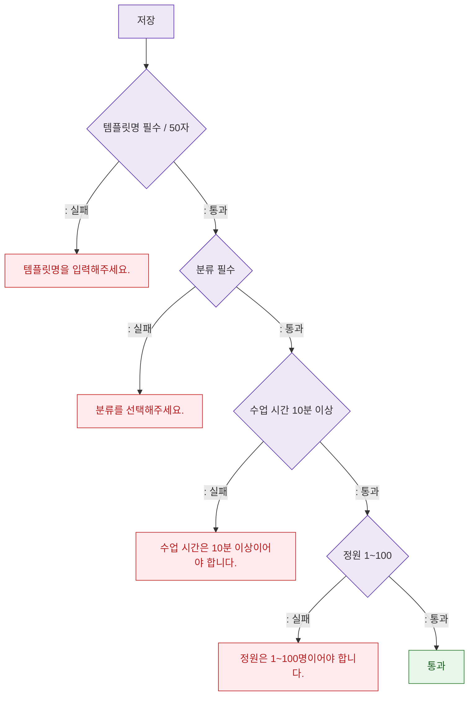

## 1. 목적
DLG-C009 필드별 유효성 검사를 정의한다.

## 2. 전제조건
- DLG-C009 열림, 저장 클릭

## 3. 다이어그램

```mermaid
flowchart TD
  Save[저장] --> V_Name{템플릿명 필수 / 50자}
  V_Name -->|": 실패"|E_Name[템플릿명을 입력해주세요.]
  V_Name -->|": 통과"|V_Category{분류 필수}
  V_Category -->|": 실패"|E_Category[분류를 선택해주세요.]
  V_Category -->|": 통과"|V_Duration{수업 시간 10분 이상}
  V_Duration -->|": 실패"|E_Duration[수업 시간은 10분 이상이어야 합니다.]
  V_Duration -->|": 통과"|V_Capacity{정원 1~100}
  V_Capacity -->|": 실패"|E_Capacity[정원은 1~100명이어야 합니다.]
  V_Capacity -->|": 통과"|AllPass[통과]

  classDef system fill:#EDE7F6,stroke:#5E35B2
  classDef error fill:#FFEBEE,stroke:#C62828,color:#B71C1C
  classDef success fill:#E8F5E9,stroke:#2E7D32,color:#1B5E20
  class Save,V_Name,V_Category,V_Duration,V_Capacity system
  class E_Name,E_Category,E_Duration,E_Capacity error
  class AllPass success
```

## 4. 엣지 설명

| 필드 | 규칙 | |------|------| | 템플릿명 | 필수, 최대 50자 | | 분류 | 필수 선택 | | 수업 시간 | 10분 이상 | | 정원 | 1~100명 |
