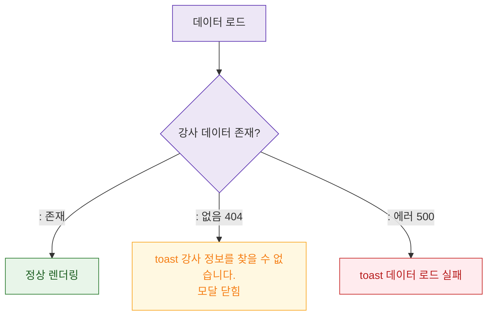

## 1. 목적
DLG-C010은 읽기전용 모달이므로 데이터 로드 유효성만 정의한다.

## 2. 전제조건
- DLG-C010 열림

## 3. 다이어그램

```mermaid
flowchart TD
  LoadData[데이터 로드] --> CheckData{강사 데이터 존재?}
  CheckData -->|": 존재"|RenderOK[정상 렌더링]
  CheckData -->|": 없음 404"|NotFound[toast 강사 정보를 찾을 수 없습니다.\n모달 닫힘]
  CheckData -->|": 에러 500"|ErrState[toast 데이터 로드 실패]

  classDef system fill:#EDE7F6,stroke:#5E35B2
  classDef success fill:#E8F5E9,stroke:#2E7D32,color:#1B5E20
  classDef error fill:#FFEBEE,stroke:#C62828,color:#B71C1C
  classDef warning fill:#FFF8E1,stroke:#F9A825,color:#F57F17
  class LoadData,CheckData system
  class RenderOK success
  class ErrState error
  class NotFound warning
```

## 4. 엣지 설명

| 상태 | 동작 | |------|------| | 200 | 정상 렌더링 | | 404 | 경고 + 모달 닫힘 | | 500 | 에러 |
