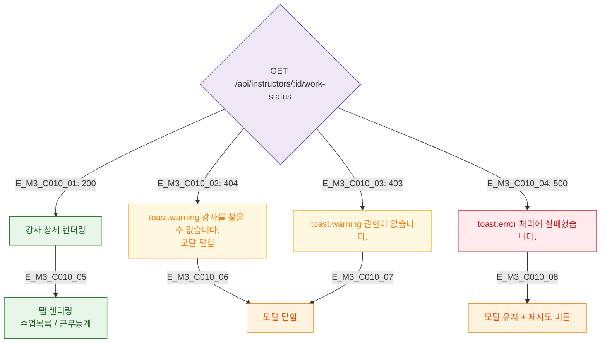

## 1. 목적
DLG-C010 데이터 로드 결과 분기를 정의한다.

## 2. 전제조건
- GET /api/instructors/:id/work-status 호출 후

## 3. 다이어그램

## 4. 엣지 설명

| 응답 | 동작 |
|------|------|
| 200 | 탭 렌더링 |
| 404/403 | 경고 + 닫힘 |
| 500 | 에러 + 재시도 |

## 5. TC 후보

| TC ID | 타입 | Given | When | Then |
|-------|------|-------|------|------|
| TC-C010-M3-01 | positive | 200 | 로드 | 탭 렌더링 |
| TC-C010-M3-02 | negative | 404 | 로드 | 경고 + 닫힘 |
