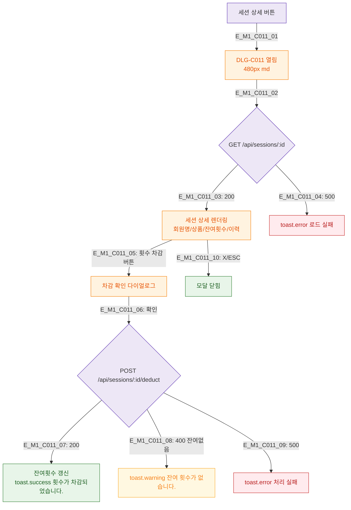

## 1. 목적
DLG-C011 PT 세션 상세 모달의 생명주기를 정의한다.

## 2. 전제조건
- SCR-C007 횟수관리에서 세션 상세 버튼 클릭

## 3. 다이어그램

## 4. 엣지 설명

| 엣지 ID | 설명 |
|---------|------|
| E_M1_C011_05~09 | 횟수 차감 플로우 |
| E_M1_C011_08 | 잔여 없음 → 경고 |

## 5. TC 후보

| TC ID | 타입 | Given | When | Then |
|-------|------|-------|------|------|
| TC-C011-M1-01 | positive | 잔여횟수 있음 | 차감 확인 | 잔여횟수 갱신 |
| TC-C011-M1-02 | negative | 잔여횟수 0 | 차감 시도 | 경고 토스트 |
| TC-C011-M1-03 | negative | 500 | 로드 | 에러 토스트 |
