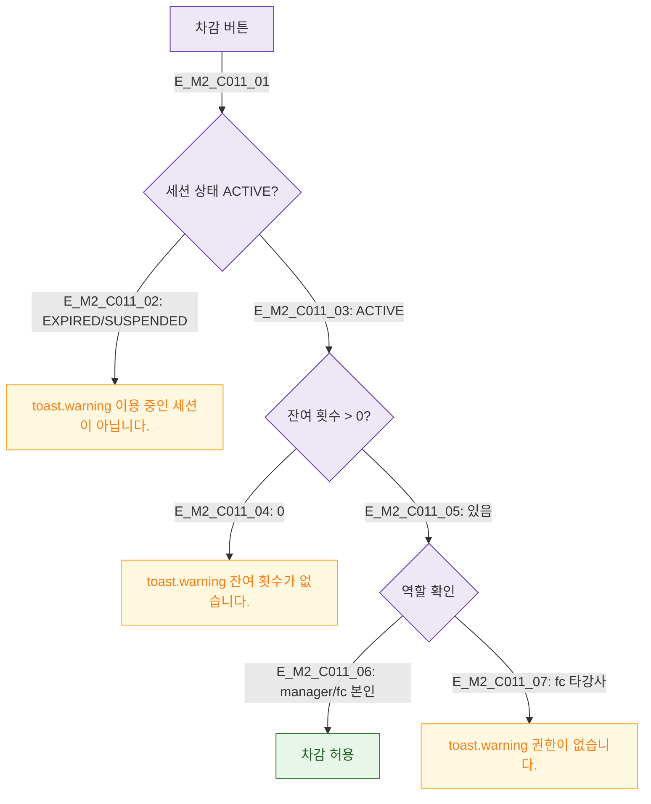

## 1. 목적
DLG-C011 횟수 차감 조건 검증을 정의한다.

## 2. 전제조건
- DLG-C011 열림, 차감 버튼 클릭

## 3. 다이어그램

## 4. 엣지 설명

| 검증 | 규칙 |
|------|------|
| 세션 상태 | ACTIVE여야 차감 가능 |
| 잔여 횟수 | 1 이상 |
| 역할 | manager 또는 fc 본인 |

## 5. TC 후보

| TC ID | 타입 | Given | When | Then |
|-------|------|-------|------|------|
| TC-C011-M2-01 | negative | EXPIRED 세션 | 차감 | 상태 경고 |
| TC-C011-M2-02 | negative | 잔여 0 | 차감 | 잔여 없음 경고 |
| TC-C011-M2-03 | positive | ACTIVE + 잔여 있음 | 차감 | 허용 |
