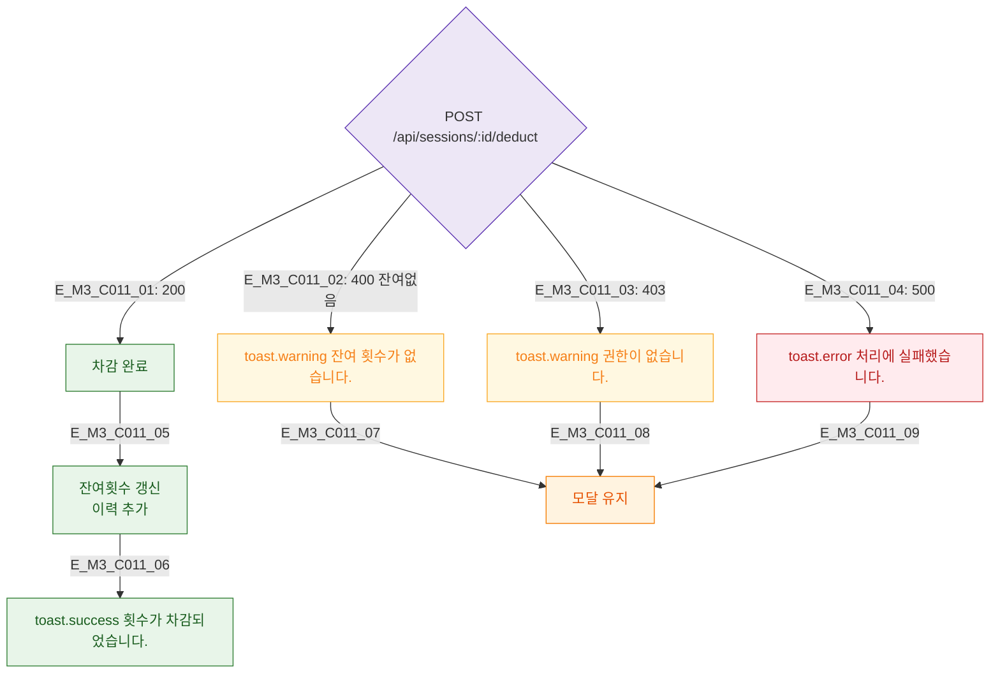

## 1. 목적
DLG-C011 횟수 차감 API 결과 분기를 정의한다.

## 2. 전제조건
- 차감 유효성 통과 후 API 호출

## 3. 다이어그램

## 4. 엣지 설명

| 응답 | 동작 |
|------|------|
| 200 | 잔여횟수 갱신 + success 토스트 |
| 400 | 잔여 없음 경고 + 유지 |
| 403/500 | 에러/경고 + 유지 |

## 5. TC 후보

| TC ID | 타입 | Given | When | Then |
|-------|------|-------|------|------|
| TC-C011-M3-01 | positive | 200 | 차감 | 잔여횟수 갱신 |
| TC-C011-M3-02 | negative | 400 | 차감 | 경고 + 유지 |
