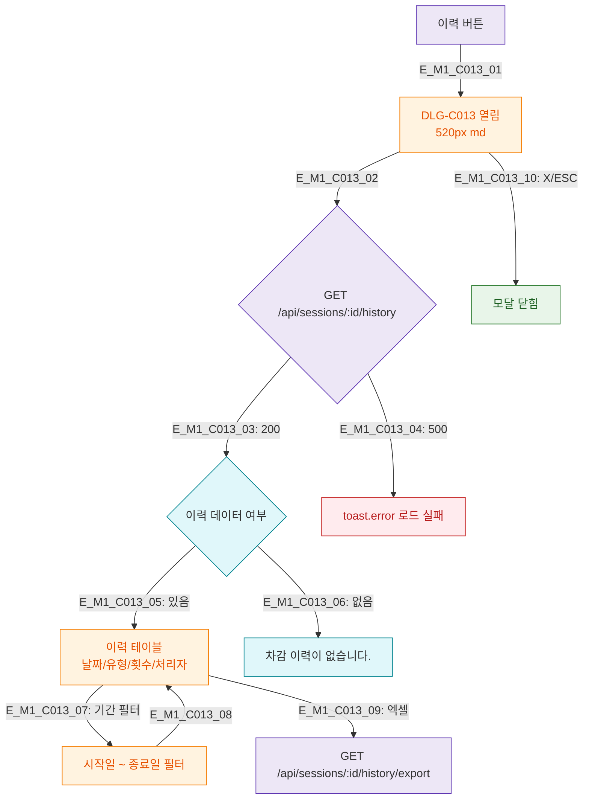

## 1. 목적
DLG-C013 PT 횟수 차감 이력 조회 모달의 생명주기를 정의한다.

## 2. 전제조건
- SCR-C007에서 이력 버튼 클릭

## 3. 다이어그램

## 4. 엣지 설명

| 엣지 ID | 설명 |
|---------|------|
| E_M1_C013_02~06 | 이력 로드 → 데이터 여부 분기 |
| E_M1_C013_07~08 | 기간 필터 적용 |
| E_M1_C013_09 | 엑셀 다운로드 |

## 5. TC 후보

| TC ID | 타입 | Given | When | Then |
|-------|------|-------|------|------|
| TC-C013-M1-01 | positive | 이력 있음 | 모달 열림 | 이력 테이블 렌더링 |
| TC-C013-M1-02 | positive | 이력 없음 | 모달 열림 | 빈 상태 표시 |
| TC-C013-M1-03 | positive | 기간 필터 | 적용 | 필터링된 이력 |
