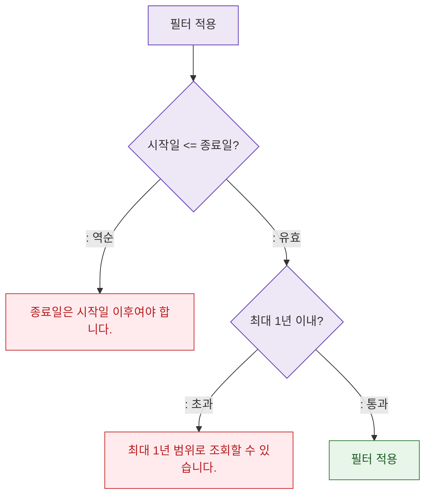

## 1. 목적
DLG-C013 기간 필터 유효성 검사를 정의한다.

## 2. 전제조건
- DLG-C013 열림, 기간 필터 적용

## 3. 다이어그램

```mermaid
flowchart TD
  Apply[필터 적용] --> V_DateRange{시작일 <= 종료일?}
  V_DateRange -->|": 역순"|E_Date[종료일은 시작일 이후여야 합니다.]
  V_DateRange -->|": 유효"|V_MaxRange{최대 1년 이내?}
  V_MaxRange -->|": 초과"|E_Range[최대 1년 범위로 조회할 수 있습니다.]
  V_MaxRange -->|": 통과"|AllPass[필터 적용]

  classDef system fill:#EDE7F6,stroke:#5E35B2
  classDef error fill:#FFEBEE,stroke:#C62828,color:#B71C1C
  classDef success fill:#E8F5E9,stroke:#2E7D32,color:#1B5E20
  class Apply,V_DateRange,V_MaxRange system
  class E_Date,E_Range error
  class AllPass success
```

## 4. 엣지 설명

| 검증 | 규칙 | |------|------| | 날짜 순서 | 시작일 <= 종료일 | | 최대 범위 | 1년 이내 |
