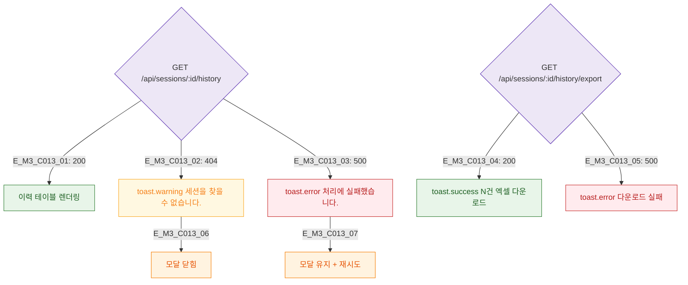

## 1. 목적
DLG-C013 이력 로드 및 엑셀 다운로드 결과 분기를 정의한다.

## 2. 전제조건
- API 호출 후

## 3. 다이어그램

## 4. 엣지 설명

| 응답 | 동작 |
|------|------|
| 200 | 이력 렌더링 |
| 404 | 경고 + 닫힘 |
| 500 | 에러 + 재시도 |

## 5. TC 후보

| TC ID | 타입 | Given | When | Then |
|-------|------|-------|------|------|
| TC-C013-M3-01 | positive | 200 | 로드 | 이력 테이블 |
| TC-C013-M3-02 | negative | 500 | 엑셀 | 다운로드 에러 |
