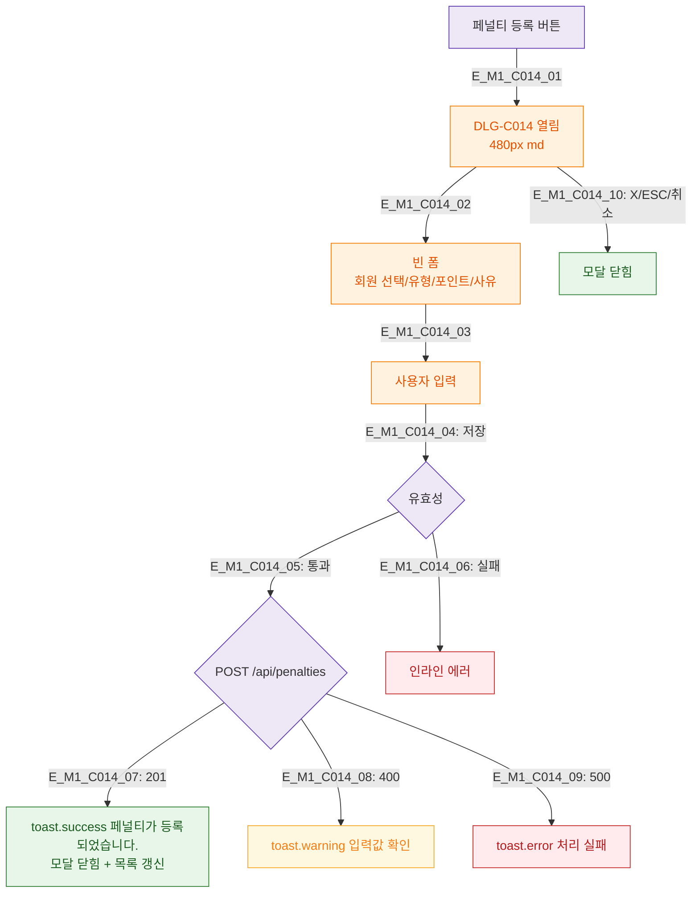

## 1. 목적
DLG-C014 수동 페널티 등록 모달의 생명주기를 정의한다.

## 2. 전제조건
- SCR-C008 페널티관리에서 페널티 등록 버튼 클릭

## 3. 다이어그램

## 4. 엣지 설명

| 엣지 ID | 설명 |
|---------|------|
| E_M1_C014_04~09 | 저장 → 유효성 → API → 성공/실패 |

## 5. TC 후보

| TC ID | 타입 | Given | When | Then |
|-------|------|-------|------|------|
| TC-C014-M1-01 | positive | 매니저 | 유효 입력 저장 | 페널티 등록 + 닫힘 |
| TC-C014-M1-02 | negative | 회원 미선택 | 저장 | 인라인 에러 |
| TC-C014-M1-03 | negative | 500 | 저장 | 에러 토스트 |
