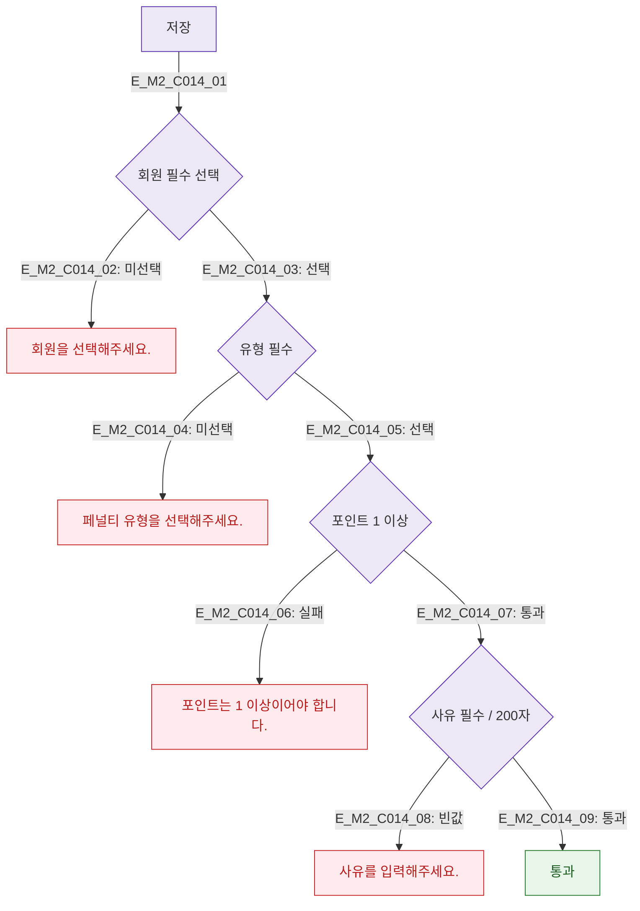

## 1. 목적
DLG-C014 페널티 등록 필드 유효성 검사를 정의한다.

## 2. 전제조건
- DLG-C014 열림, 저장 클릭

## 3. 다이어그램

## 4. 엣지 설명

| 필드 | 규칙 |
|------|------|
| 회원 | 필수 선택 |
| 유형 | 필수 선택 |
| 포인트 | 1 이상 정수 |
| 사유 | 필수, 최대 200자 |

## 5. TC 후보

| TC ID | 타입 | Given | When | Then |
|-------|------|-------|------|------|
| TC-C014-M2-01 | negative | 회원 미선택 | 저장 | 에러 |
| TC-C014-M2-02 | negative | 포인트 0 | 저장 | 에러 |
| TC-C014-M2-03 | negative | 사유 빈값 | 저장 | 에러 |
| TC-C014-M2-04 | positive | 전체 유효 | 저장 | 통과 |
