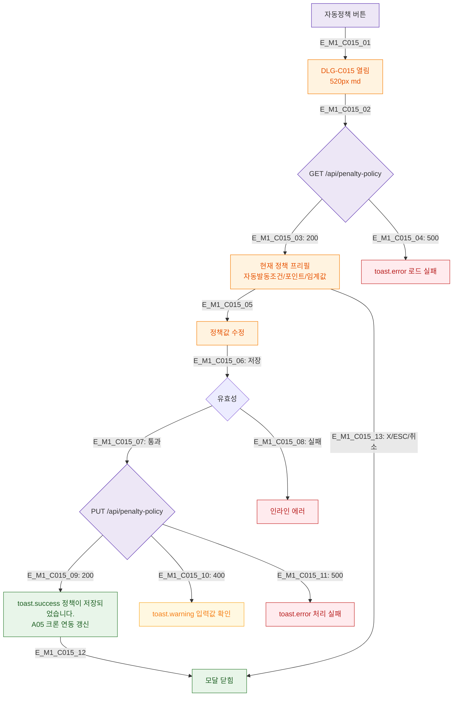

## 1. 목적
DLG-C015 자동 페널티 정책 설정 모달의 생명주기를 정의한다.

## 2. 전제조건
- SCR-C008에서 자동정책 버튼 클릭 (manager/owner 전용)

## 3. 다이어그램

## 4. 엣지 설명

| 엣지 ID | 설명 |
|---------|------|
| E_M1_C015_09 | 저장 성공 → A05 크론 연동 갱신 |
| E_M1_C015_02~04 | 진입 시 현재 정책 로드 |

## 5. TC 후보

| TC ID | 타입 | Given | When | Then |
|-------|------|-------|------|------|
| TC-C015-M1-01 | positive | 매니저 | 자동정책 버튼 | 현재 정책 프리필 |
| TC-C015-M1-02 | positive | 정책 수정 저장 | 저장 | success + A05 갱신 |
| TC-C015-M1-03 | negative | 500 | 저장 | 에러 + 유지 |
