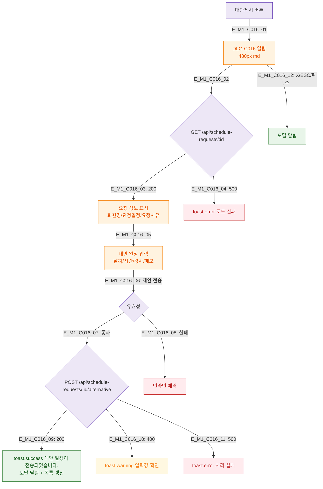

## 1. 목적
DLG-C016 일정 요청 거절 시 대안 일정 제시 모달의 생명주기를 정의한다.

## 2. 전제조건
- SCR-C009 일정요청처리에서 대안제시 버튼 클릭

## 3. 다이어그램

## 4. 엣지 설명

| 엣지 ID | 설명 |
|---------|------|
| E_M1_C016_02~04 | 요청 정보 로드 |
| E_M1_C016_05~11 | 대안 일정 입력 → 전송 → 결과 |

## 5. TC 후보

| TC ID | 타입 | Given | When | Then |
|-------|------|-------|------|------|
| TC-C016-M1-01 | positive | 매니저 | 대안제시 버튼 | 요청 정보 + 입력 폼 |
| TC-C016-M1-02 | positive | 유효 대안 | 전송 | success 토스트 + 닫힘 |
| TC-C016-M1-03 | negative | 날짜 미입력 | 전송 | 인라인 에러 |
