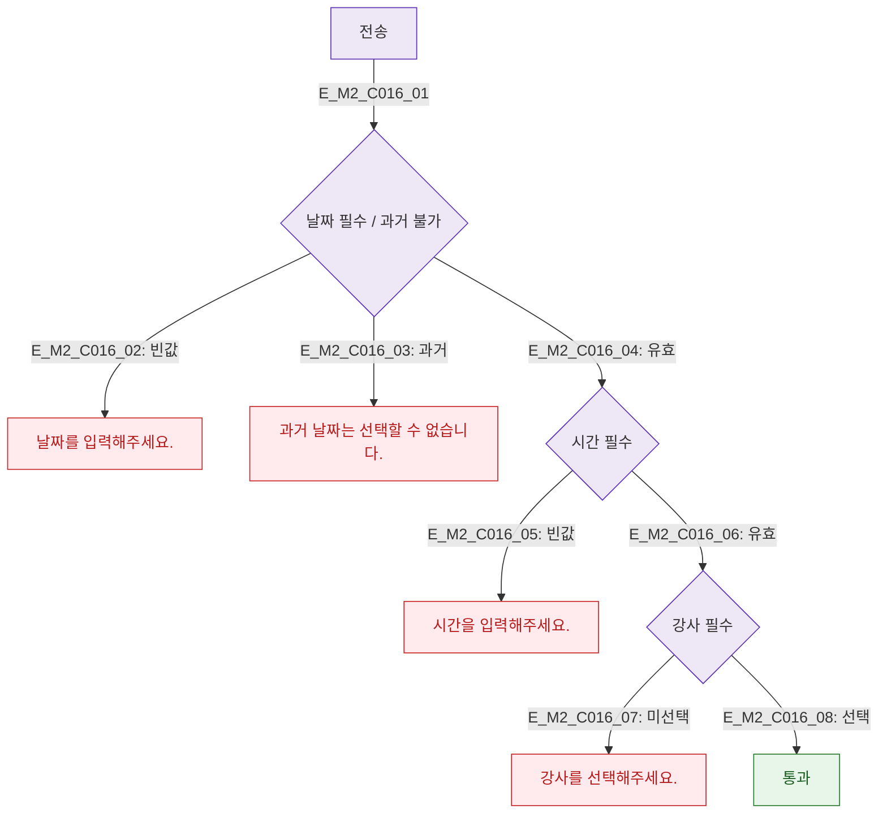

## 1. 목적
DLG-C016 대안 일정 입력 필드 유효성 검사를 정의한다.

## 2. 전제조건
- DLG-C016 열림, 전송 클릭

## 3. 다이어그램

## 4. 엣지 설명

| 필드 | 규칙 |
|------|------|
| 날짜 | 필수, 과거 불가 |
| 시간 | 필수 |
| 강사 | 필수 선택 |

## 5. TC 후보

| TC ID | 타입 | Given | When | Then |
|-------|------|-------|------|------|
| TC-C016-M2-01 | negative | 날짜 빈값 | 전송 | 에러 |
| TC-C016-M2-02 | negative | 과거 날짜 | 전송 | 과거 에러 |
| TC-C016-M2-03 | positive | 전체 유효 | 전송 | 통과 |
