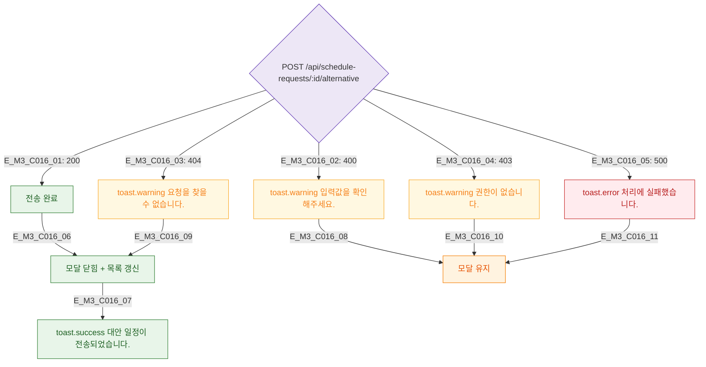

## 1. 목적
DLG-C016 대안 일정 전송 API 결과 분기를 정의한다.

## 2. 전제조건
- 유효성 통과 후 API 호출

## 3. 다이어그램

## 4. 엣지 설명

| 응답 | 동작 |
|------|------|
| 200 | 닫힘 + success 토스트 |
| 400/403 | 경고 + 유지 |
| 404 | 경고 + 닫힘 (요청 이미 처리됨) |
| 500 | 에러 + 유지 |

## 5. TC 후보

| TC ID | 타입 | Given | When | Then |
|-------|------|-------|------|------|
| TC-C016-M3-01 | positive | 200 | 전송 | 닫힘 + success |
| TC-C016-M3-02 | negative | 404 | 전송 | 경고 + 닫힘 |
| TC-C016-M3-03 | negative | 500 | 전송 | 에러 + 유지 |
