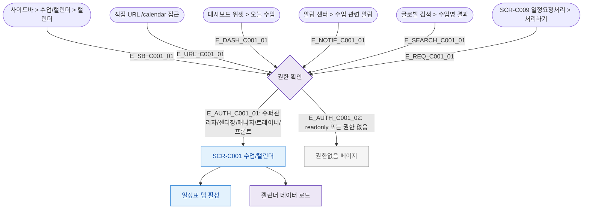

## 1. 목적
SCR-C001 수업/캘린더 화면으로 진입할 수 있는 모든 경로를 정의한다.

## 2. 전제조건
- 사용자가 로그인된 상태
- 수업관리 도메인 접근 권한 보유

## 3. 다이어그램

## 4. 엣지 설명

| 엣지 ID | 출발 | 도착 | 조건/액션 |
|---------|------|------|-----------|
| E_SB_C001_01 | 사이드바 | Auth | 메뉴 클릭 |
| E_URL_C001_01 | URL | Auth | 직접 접근 |
| E_DASH_C001_01 | 대시보드 | Auth | 위젯 클릭 |
| E_NOTIF_C001_01 | 알림 | Auth | 알림 클릭 |
| E_SEARCH_C001_01 | 검색 | Auth | 검색결과 클릭 |
| E_REQ_C001_01 | SCR-C009 | Auth | 처리하기 버튼 |
| E_AUTH_C001_01 | Auth | SCR_C001 | 권한 있음 |
| E_AUTH_C001_02 | Auth | Blocked | 권한 없음 |

## 5. TC 후보

| TC ID | 타입 | Given | When | Then |
|-------|------|-------|------|------|
| TC-C001-F1-01 | positive | 매니저 로그인 | 사이드바 캘린더 클릭 | SCR-C001 진입, 캘린더 표시 |
| TC-C001-F1-02 | positive | 트레이너 로그인 | 직접 URL /calendar 접근 | SCR-C001 진입, 본인 수업만 표시 |
| TC-C001-F1-03 | negative | readonly 로그인 | 사이드바 캘린더 클릭 | 권한없음 페이지 표시 |
| TC-C001-F1-04 | positive | 매니저 | 알림 센터 수업 알림 클릭 | SCR-C001 해당 날짜로 이동 |
