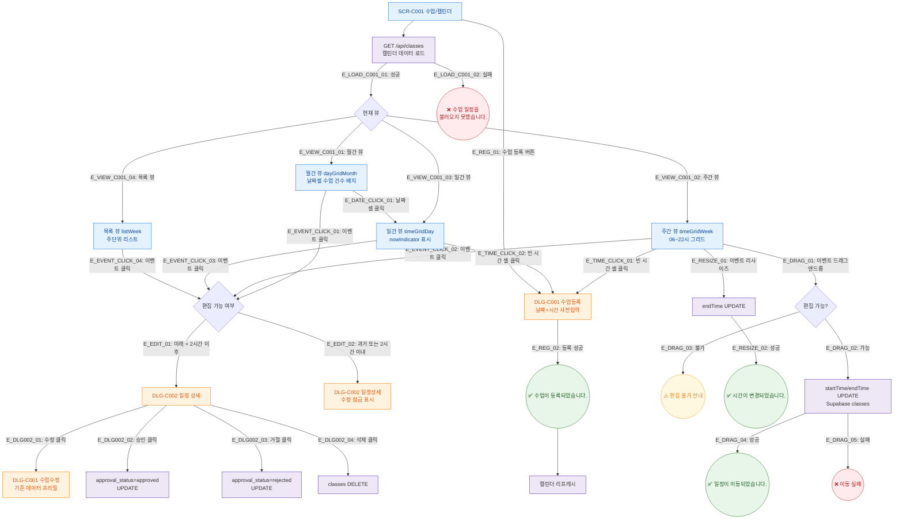

## 1. 목적
SCR-C001의 Happy Path — 캘린더 뷰 전환, 이벤트 클릭, 드래그앤드롭, 수업 등록/수정의 정상 흐름을 정의한다.

## 2. 전제조건
- SCR-C001 진입 완료
- 캘린더 데이터 로드 완료

## 3. 다이어그램

## 4. 엣지 설명

| 엣지 ID | 출발 | 도착 | 조건/액션 |
|---------|------|------|-----------|
| E_LOAD_C001_01 | LoadData | CalView | API 성공 |
| E_LOAD_C001_02 | LoadData | ToastErr | API 실패 |
| E_VIEW_C001_01~04 | CalView | 각 뷰 | 뷰 탭 전환 |
| E_DATE_CLICK_01 | MonthView | DayView | 날짜 셀 클릭 (월간→일간) |
| E_TIME_CLICK_01~02 | WeekView/DayView | DLG_C001_New | 빈 시간 셀 클릭 |
| E_EVENT_CLICK_01~04 | 각 뷰 | EditCheck | 이벤트 클릭 |
| E_EDIT_01 | EditCheck | DLG_C002 | 편집 가능 |
| E_EDIT_02 | EditCheck | DLG_C002_RO | 편집 불가 |
| E_DRAG_01 | WeekView | DragCheck | 드래그앤드롭 |
| E_DRAG_02~05 | DragCheck/UpdateTime | 각 결과 | 드래그 성공/실패 |
| E_RESIZE_01~02 | WeekView/UpdateEnd | 각 결과 | 리사이즈 |

## 5. TC 후보

| TC ID | 타입 | Given | When | Then |
|-------|------|-------|------|------|
| TC-C001-F2-01 | positive | 매니저, 캘린더 | 빈 시간 셀 클릭 | DLG-C001 날짜+시간 사전입력 열림 |
| TC-C001-F2-02 | positive | 매니저, 미래 수업 | 이벤트 클릭 | DLG-C002 정상 열림, 수정버튼 활성 |
| TC-C001-F2-03 | negative | 매니저, 과거 수업 | 이벤트 클릭 | DLG-C002 열림, 수정버튼 잠금 표시 |
| TC-C001-F2-04 | positive | 매니저, 미래 수업 | 드래그앤드롭 | API 호출, 토스트 "일정이 이동되었습니다." |
| TC-C001-F2-05 | negative | 매니저, 과거 수업 | 드래그 시도 | 토스트 경고, 이동 안 됨 |
| TC-C001-F2-06 | positive | 매니저 | 수업 등록 버튼 | DLG-C001 열림 |
| TC-C001-F2-07 | exception | API 500 | 캘린더 진입 | 에러 토스트 표시 |
