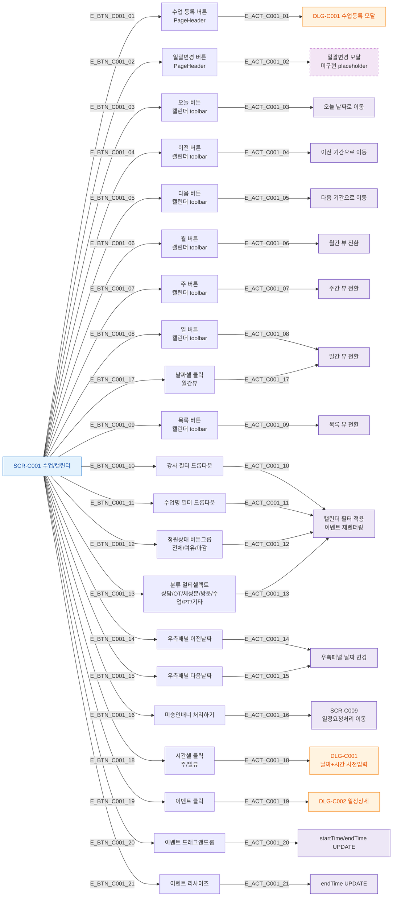

## 1. 목적
SCR-C001의 모든 버튼 및 인터랙션 노드를 열거하고 각각의 동작을 매핑한다.

## 2. 전제조건
- SCR-C001 진입 완료

## 3. 다이어그램

## 4. 엣지 설명

| 엣지 ID | 버튼 | 동작 |
|---------|------|------|
| E_BTN_C001_01 | 수업 등록 | DLG-C001 열기 |
| E_BTN_C001_02 | 일괄변경 | 미구현 플레이스홀더 |
| E_BTN_C001_03~05 | 오늘/이전/다음 | 날짜 네비게이션 |
| E_BTN_C001_06~09 | 월/주/일/목록 | 뷰 전환 |
| E_BTN_C001_10~13 | 각 필터 | 캘린더 필터 적용 |
| E_BTN_C001_14~15 | 패널 이전/다음 | 우측 패널 날짜 변경 |
| E_BTN_C001_16 | 처리하기 | SCR-C009 이동 |
| E_BTN_C001_17 | 날짜셀 | 일간 뷰 전환 |
| E_BTN_C001_18 | 시간셀 | DLG-C001 사전입력 |
| E_BTN_C001_19 | 이벤트 | DLG-C002 열기 |
| E_BTN_C001_20 | 드래그 | 시간 UPDATE |
| E_BTN_C001_21 | 리사이즈 | 종료시간 UPDATE |

## 5. TC 후보

| TC ID | 타입 | Given | When | Then |
|-------|------|-------|------|------|
| TC-C001-F3-01 | positive | 매니저 | 월간 뷰에서 날짜 클릭 | 일간 뷰로 전환 |
| TC-C001-F3-02 | positive | 매니저 | 주간 뷰 빈 시간 클릭 | DLG-C001 날짜+시간 사전입력 |
| TC-C001-F3-03 | positive | 매니저 | 오늘 버튼 클릭 | 오늘 날짜로 이동 |
| TC-C001-F3-04 | positive | 매니저 | 강사 필터 선택 | 해당 강사 수업만 표시 |
| TC-C001-F3-05 | positive | 매니저 | 미승인배너 처리하기 | SCR-C009로 이동 |
