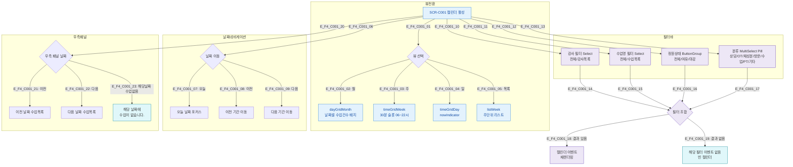

## 1. 목적
SCR-C001의 필터(강사/수업명/정원상태/분류), 뷰 전환(월/주/일/목록), 날짜 네비게이션의 조합 플로우를 정의한다.

## 2. 전제조건
- SCR-C001 진입, 캘린더 데이터 로드 완료

## 3. 다이어그램

## 4. 엣지 설명

| 엣지 ID | 출발 | 도착 | 조건 |
|---------|------|------|------|
| E_F4_C001_01~05 | CAL/ViewSelect | 각 뷰 | 뷰 탭 클릭 |
| E_F4_C001_06~09 | CAL/NavBtn | 날짜 이동 | 오늘/이전/다음 클릭 |
| E_F4_C001_10~13 | CAL | 각 필터 | 필터 조작 |
| E_F4_C001_14~17 | 각 필터 | Combine | 필터 값 변경 |
| E_F4_C001_18 | Combine | ReRender | 결과 있음 |
| E_F4_C001_19 | Combine | EmptyCal | 결과 없음 |
| E_F4_C001_20~23 | CAL/PanelNav | 패널 결과 | 날짜 이동 |

## 5. TC 후보

| TC ID | 타입 | Given | When | Then |
|-------|------|-------|------|------|
| TC-C001-F4-01 | positive | 매니저 | 강사 필터 선택 | 해당 강사 수업만 표시 |
| TC-C001-F4-02 | positive | 매니저 | 정원상태 '마감' 선택 | 마감 수업만 표시 |
| TC-C001-F4-03 | positive | 매니저 | 분류 'PT' 선택 | PT 분류 수업만 표시 |
| TC-C001-F4-04 | positive | 매니저 | 여러 필터 동시 적용 | 교집합 결과 표시 |
| TC-C001-F4-05 | negative | 매니저 | 결과 없는 필터 적용 | 빈 캘린더 표시 |
| TC-C001-F4-06 | positive | 매니저 | 주간→월간 뷰 전환 | 월간 뷰로 전환됨 |
