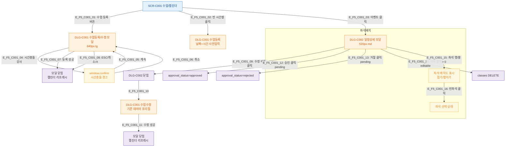

## 1. 목적
SCR-C001에서 트리거 가능한 모든 모달과 하위 모달 연결 트리를 정의한다.

## 2. 전제조건
- SCR-C001 진입 완료

## 3. 다이어그램

## 4. 엣지 설명

| 엣지 ID | 출발 | 도착 | 조건 |
|---------|------|------|------|
| E_F5_C001_01 | SCR_C001 | DLG_C001_New | 수업 등록 버튼 |
| E_F5_C001_02 | SCR_C001 | DLG_C001_Pre | 빈 시간셀 클릭 |
| E_F5_C001_03 | SCR_C001 | DLG_C002 | 이벤트 클릭 |
| E_F5_C001_04 | DLG_C001_New | Confirm_Conflict | 강사 시간충돌 감지 |
| E_F5_C001_09~10 | DLG_C002 | DLG_C001_Edit | 수정 버튼 클릭 |
| E_F5_C001_12~14 | DLG_C002 | 각 API | 승인/거절/삭제 |
| E_F5_C001_15~16 | DLG_C002 | 좌석 | 좌석배치 인터랙션 |

## 5. TC 후보

| TC ID | 타입 | Given | When | Then |
|-------|------|-------|------|------|
| TC-C001-F5-01 | positive | 매니저 | 수업 등록 버튼 | DLG-C001 열림 |
| TC-C001-F5-02 | positive | 매니저 | 이벤트 클릭 | DLG-C002 열림 |
| TC-C001-F5-03 | positive | 매니저, DLG-C002 수정 | 수정 버튼 클릭 | DLG-C002 닫히고 DLG-C001 프리필로 열림 |
| TC-C001-F5-04 | positive | 매니저, 강사 시간 충돌 | 수업 등록 시도 | window.confirm 경고 표시 |
| TC-C001-F5-05 | positive | 매니저, 좌석배치 설정된 수업 | 이벤트 클릭 | DLG-C002 좌석 배치도 표시 |
