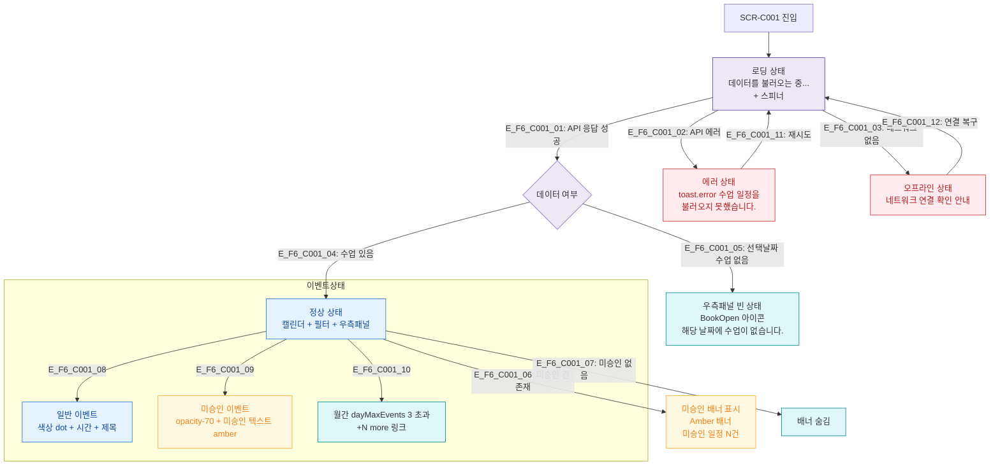

## 1. 목적
SCR-C001의 로딩/정상/빈/에러/미승인/오프라인 등 모든 UI 상태 분기를 정의한다.

## 2. 전제조건
- SCR-C001 진입 시도

## 3. 다이어그램

## 4. 엣지 설명

| 엣지 ID | 출발 | 도착 | 조건 |
|---------|------|------|------|
| E_F6_C001_01 | Loading | DataCheck | API 성공 |
| E_F6_C001_02 | Loading | ErrorState | API 에러 |
| E_F6_C001_03 | Loading | OfflineState | 네트워크 없음 |
| E_F6_C001_04 | DataCheck | NormalState | 데이터 있음 |
| E_F6_C001_05 | DataCheck | PanelEmpty | 선택날짜 수업 없음 |
| E_F6_C001_06 | NormalState | PendingBanner | 미승인 건 존재 |
| E_F6_C001_08~10 | NormalState | 이벤트 상태 | 이벤트 종류별 |
| E_F6_C001_11~12 | 에러/오프라인 | Loading | 재시도 |

## 5. TC 후보

| TC ID | 타입 | Given | When | Then |
|-------|------|-------|------|------|
| TC-C001-F6-01 | positive | 매니저 | 캘린더 진입 | 로딩 스피너 표시 후 캘린더 렌더링 |
| TC-C001-F6-02 | negative | API 500 | 캘린더 진입 | 에러 토스트 표시 |
| TC-C001-F6-03 | positive | 미승인 수업 있음 | 캘린더 진입 | 상단 amber 배너 표시 |
| TC-C001-F6-04 | positive | 수업 있는 날짜 선택 | 우측패널 날짜 이동 | 수업 목록 표시 |
| TC-C001-F6-05 | positive | 수업 없는 날짜 선택 | 우측패널 날짜 이동 | "수업이 없습니다" 메시지 |
| TC-C001-F6-06 | exception | 네트워크 없음 | 캘린더 진입 | 오프라인 안내 표시 |
