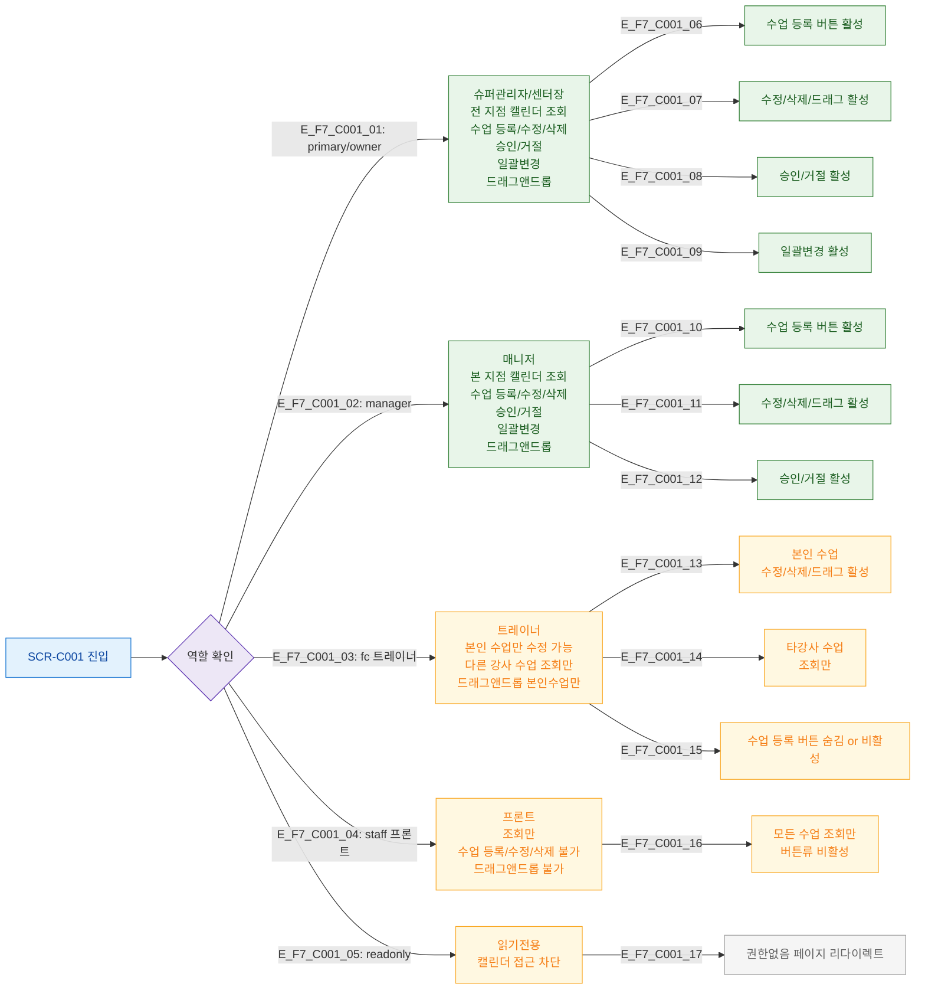

## 1. 목적
SCR-C001에서 6개 역할별 접근 가능 기능 범위를 정의한다.

## 2. 전제조건
- 로그인 완료, 역할(role) 보유

## 3. 다이어그램

## 4. 엣지 설명

| 역할 | 수업 등록 | 수정/삭제 | 드래그앤드롭 | 승인/거절 | 일괄변경 |
|------|----------|----------|------------|----------|---------|
| primary/owner | O | O (전체) | O | O | O |
| manager | O | O (전체) | O | O | O |
| fc (트레이너) | X | O (본인만) | O (본인만) | X | X |
| staff (프론트) | X | X | X | X | X |
| readonly | 접근차단 | 접근차단 | 접근차단 | 접근차단 | 접근차단 |

## 5. TC 후보

| TC ID | 타입 | Given | When | Then |
|-------|------|-------|------|------|
| TC-C001-F7-01 | positive | manager | 수업 등록 버튼 클릭 | DLG-C001 열림 |
| TC-C001-F7-02 | negative | staff(프론트) | 수업 등록 버튼 클릭 | 버튼 비활성 or 토스트 경고 |
| TC-C001-F7-03 | positive | fc(트레이너), 본인 수업 | 드래그앤드롭 | 이동 성공 |
| TC-C001-F7-04 | negative | fc(트레이너), 타강사 수업 | 드래그 시도 | 이동 불가 |
| TC-C001-F7-05 | negative | readonly | URL 직접 접근 | 권한없음 페이지 |
